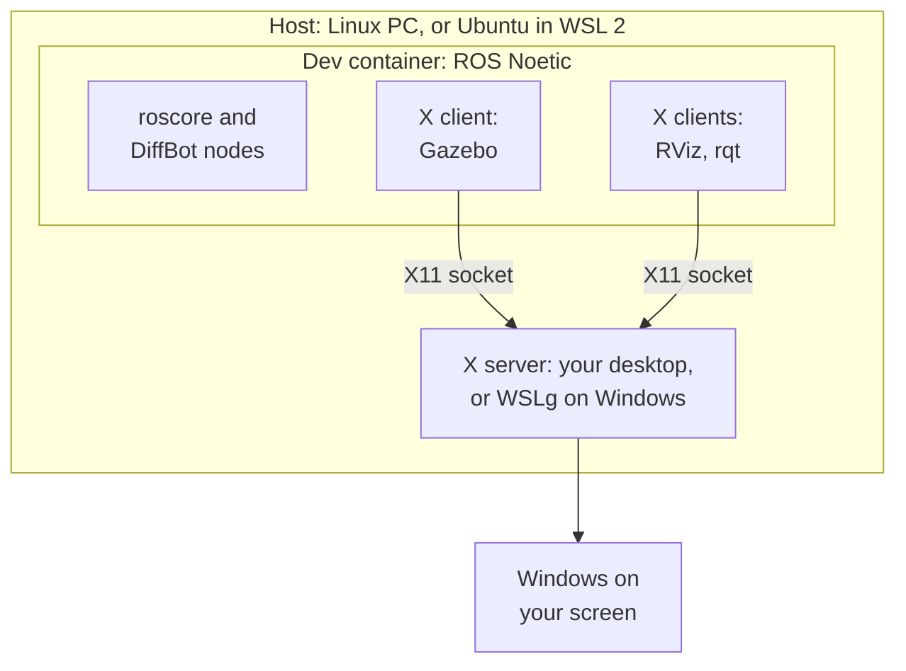

# Development Environment

The diffbot repository has a dev container for ROS 1 Noetic: a Docker image with Ubuntu 20.04, ROS Noetic, Gazebo 11, RViz and every dependency of the DiffBot packages. Every developer, and [CI](ci.md#dev-container-workflow), gets the same environment, on Linux and on Windows with WSL 2.

It's the recommended setup for the development PC. The robot's single board computer is still set up natively, see [Packages Setup](../packages/packages-setup.md).

## How the pieces fit together

A few terms first:

- **Host:** the computer that runs Docker Engine and the container. That's your Linux PC, or on Windows the Ubuntu that runs in [WSL 2](https://learn.microsoft.com/en-us/windows/wsl/) (Windows Subsystem for Linux). "On the host" means in a terminal of that Linux, not inside the container.
- **Container:** a separate Ubuntu 20.04 with ROS Noetic that runs on the host ([what is a container](https://docs.docker.com/get-started/docker-concepts/the-basics/what-is-a-container/)). A *dev container* is a container set up for development, described by a `devcontainer.json` file ([containers.dev](https://containers.dev/)). Your clone of the diffbot repository is shared with it, so you edit files on the host and build and run them in the container.
- **X server and X clients:** Linux GUI programs use the [X Window System](https://www.x.org/releases/current/doc/man/man7/X.7.xhtml) (X11). The *X server* is the program that draws windows on your screen, so it runs where the screen is. The programs that want windows, like RViz, Gazebo and rqt, are *X clients*: each one connects to the X server and tells it what to draw. One X server serves many clients, and the clients may run somewhere else, for example in the container. The naming feels backwards at first: the server is on your desk, and the apps are its clients.
- **Which X server:** on a Linux desktop, the desktop's own (Xwayland on [Wayland](https://wayland.freedesktop.org/) desktops). On Windows, [WSLg](https://github.com/microsoft/wslg) (Windows Subsystem for Linux GUI, part of WSL 2 on Windows 11 and on Windows 10 build 19044 or later, see the [prerequisites](https://learn.microsoft.com/en-us/windows/wsl/tutorials/gui-apps)) is the X server for Linux programs and shows their windows on the Windows desktop.

How VS Code works with a dev container: its window runs on your PC, while a VS Code server, the terminals, the build and the running programs are in the container. The source code stays on your PC and is mounted into the container.

<figure>
  
  <figcaption>Diagram: <a href="https://code.visualstudio.com/docs/devcontainers/containers">Visual Studio Code documentation</a>, Microsoft, <a href="https://creativecommons.org/licenses/by/3.0/us/">CC BY 3.0 US</a></figcaption>
</figure>

**Simulation, no robot needed:** everything runs in the container. Gazebo simulates the robot, RViz shows what it sees. They are X clients, and their windows appear on your screen through the host's X server:



**With the real robot:** the robot runs ROS natively on its Raspberry Pi (see [Packages Setup](../packages/packages-setup.md)), and the container on your PC joins its ROS network. RViz, mapping and navigation can then run on the PC:

```mermaid
graph TB
  subgraph PC [Your PC: dev container]
    C[RViz, SLAM,<br/>navigation]
  end
  subgraph ROBOT [Robot: Raspberry Pi, ROS Noetic]
    M[roscore:<br/>ROS master]
    B[Bringup: drivers,<br/>hardware interface]
  end
  T[Teensy: motors<br/>and encoders]
  C -. 1. register, look up .-> M
  B -. 1. register, look up .-> M
  C ---|2. topics and services,<br/>directly, both ways| B
  B ---|USB, rosserial| T
```

Every node first registers with the ROS master and asks it where the other nodes are (1). After that, the nodes send their topics and services directly to each other, in both directions (2). That's why the robot must be able to reach your PC, not only the other way round. Both kinds of traffic go over Wi-Fi or your LAN. The container shares the host's network (see [Network](dev-container-internals.md#network)), and the windows reach your screen as described in [GUI apps](dev-container-internals.md#gui-apps-x11-and-wslg).

## Requirements

- **Docker Engine on the host:** [Docker Engine](https://docs.docker.com/engine/) on your Linux PC, or inside the Ubuntu in WSL 2. That's the tested setup. To install it on Ubuntu, including the Ubuntu in WSL 2:

    ```console
    sudo apt install docker.io docker-compose-v2 docker-buildx
    sudo usermod -aG docker $USER
    ```

    Log out and in again so the new `docker` group applies (see Docker's [post-installation steps](https://docs.docker.com/engine/install/linux-postinstall/)). On WSL 2, run `wsl --shutdown` in Windows PowerShell and open Ubuntu again.

    [Docker Desktop](https://docs.docker.com/desktop/) runs Docker in its own separate virtual machine, so its "host" isn't your Ubuntu. Its host network, which this setup uses, is an opt-in feature from version 4.34 (Settings → Resources → Network → **Enable host networking**) and only carries TCP and UDP, unlike on Linux ([Docker docs](https://docs.docker.com/engine/network/drivers/host/#docker-desktop)). Docker Desktop isn't tested with this setup, and especially not with the robot.

- **A way to start the container:** [VS Code](https://code.visualstudio.com/) with the [Dev Containers extension](https://marketplace.visualstudio.com/items?itemName=ms-vscode-remote.remote-containers), the [Dev Container CLI](https://github.com/devcontainers/cli) (`npm install -g @devcontainers/cli`), or plain Docker.
- **For windows like RViz and Gazebo:**
    - On Windows with WSL 2: nothing to install, WSLg shows them on the Windows desktop.
    - On a Linux desktop: install `xauth` on the host (`sudo apt install xauth`). The X server only accepts clients that present the display's *cookie*. In X11, a cookie is a secret: a random 128-bit value that your desktop creates when you log in, so no other user or program can draw on your screen or read it ([X security](https://www.x.org/releases/current/doc/man/man7/Xsecurity.7.xhtml)). It has nothing to do with web cookies. [`xauth`](https://www.x.org/releases/current/doc/man/man1/xauth.1.xhtml) is the standard tool for these cookies, and the setup uses it to hand yours to the container (see [GUI apps](dev-container-internals.md#gui-apps-x11-and-wslg)).
- **For the real robot from WSL 2:** WSL's mirrored networking, so the robot can reach your PC (see [Network](dev-container-internals.md#network)). Simulation doesn't need it.

## Usage

Clone the repository on the host first:

```console
git clone https://github.com/ros-mobile-robots/diffbot.git
cd diffbot
```

=== "VS Code"

    Open the `diffbot` folder and choose **Reopen in Container** (or run **Dev Containers: Reopen in Container** from the command palette). The first start builds the image and the workspace, which takes a few minutes.

=== "Dev Container CLI"

    ```console
    devcontainer up --workspace-folder . --config .devcontainer/noetic/devcontainer.json
    devcontainer exec --workspace-folder . --config .devcontainer/noetic/devcontainer.json bash
    ```

=== "Plain Docker"

    The image's user has UID 1000, which is the usual UID of the first user on Linux. With another UID, use VS Code or the CLI, which adapt it (see [Creating the container](dev-container-internals.md#creating-the-container)).

    ```console
    docker build -f .devcontainer/noetic/Dockerfile -t diffbot:noetic .
    bash .devcontainer/noetic/host-x11.sh
    docker run -it --rm --net=host -v /tmp/.X11-unix:/tmp/.X11-unix -e DISPLAY \
      -e XAUTHORITY=/home/ros/catkin_ws/src/diffbot/.devcontainer/noetic/.x11/xauth \
      -v "$PWD":/home/ros/catkin_ws/src/diffbot diffbot:noetic \
      bash -c "bash src/diffbot/.devcontainer/noetic/setup.sh && bash"
    ```

Inside the container, the workspace is `~/catkin_ws`, already built and sourced. This happens automatically: the image adds `source /opt/ros/noetic/setup.bash` to `~/.bashrc`, and when the container is created, [`setup.sh`]({{ diffbot_repo_url }}/.devcontainer/noetic/setup.sh) builds the workspace with `catkin build` and adds `source ~/catkin_ws/devel/setup.bash`. Every new interactive Bash terminal in the container reads `~/.bashrc`, so ROS and the workspace are ready there. Scripts and other non-interactive commands don't read it; they need to source the two files themselves. Your clone is mounted at `~/catkin_ws/src/diffbot`, so edits on the host show up in the container and the other way round. For example, start the simulation with Gazebo and RViz:

```console
roslaunch diffbot_control diffbot.launch
```

After changing code, rebuild with `catkin build` in `~/catkin_ws`.

How the image, the container, the network and the display access work in detail: [How the Dev Container Works](dev-container-internals.md).

## Updating

- **New ROS or system dependency:** add it to the package's `package.xml`. Then rebuild the container: **Dev Containers: Rebuild Container** in VS Code, or with the CLI, from the diffbot folder:

    ```console
    devcontainer up --workspace-folder . --config .devcontainer/noetic/devcontainer.json --remove-existing-container
    ```

- **New source dependency:** add the repository to [`diffbot_dev.repos`]({{ diffbot_repo_url }}/diffbot_dev.repos), and to the robot's `.repos` file if the robot needs it too.
- **Tools in the image:** add them to the `apt-get install` list in the Dockerfile.

## Troubleshooting

| Problem | Fix |
|:--------|:----|
| `permission denied` on `/var/run/docker.sock` | Your user isn't in the `docker` group yet. Add it, then log out and in (WSL 2: `wsl --shutdown`). |
| `No protocol specified` or `cannot open display` on native Linux | Install `xauth` on the host and recreate the container (see [GUI apps](dev-container-internals.md#gui-apps-x11-and-wslg)). Check that `echo $DISPLAY` shows a display on the host. |
| Files in the clone belong to another user (plain Docker) | Your UID isn't 1000. Use VS Code or the CLI, which adapt the UID (see [Creating the container](dev-container-internals.md#creating-the-container)). |
| Gazebo is slow | The container renders without GPU acceleration, which isn't set up yet. |
