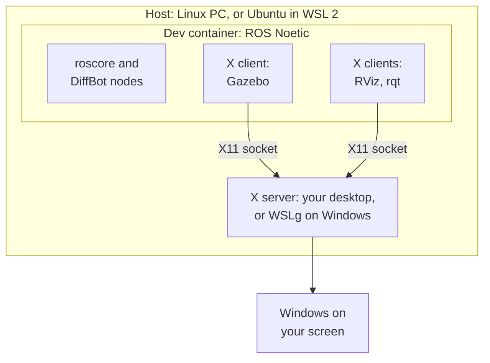

# Use the Dev Container

The diffbot repository has a dev container for ROS 1 Noetic: a Docker image with Ubuntu 20.04, ROS Noetic, Gazebo 11, RViz and every dependency of the DiffBot packages. Every developer, and [CI](ci.md#dev-container-workflow), gets the same environment, on Linux and on Windows with WSL 2.

It's the recommended setup for the development PC. Prepare the PC first, as described in [Set Up Your PC](../getting-started/set-up-your-pc.md). The robot's single board computer is still set up natively, see [Getting Started](../technical_requirements.md#real-robot).

## How the pieces fit together

A few terms first:

- **Host:** the computer that runs Docker Engine and the container. That's your Linux PC, or on Windows the Ubuntu that runs in [WSL 2](https://learn.microsoft.com/en-us/windows/wsl/) (Windows Subsystem for Linux). "On the host" means in a terminal of that Linux, not inside the container.
- **Container:** a separate Ubuntu 20.04 with ROS Noetic that runs on the host ([what is a container](https://docs.docker.com/get-started/docker-concepts/the-basics/what-is-a-container/)). A *dev container* is a container set up for development, described by a `devcontainer.json` file ([containers.dev](https://containers.dev/)). Your clone of the diffbot repository is shared with it, so you edit files on the host and build and run them in the container.
- **X server and X clients:** Linux GUI programs use the [X Window System](https://www.x.org/releases/current/doc/man/man7/X.7.xhtml) (X11). The *X server* is the program that draws windows on your screen, so it runs where the screen is. The programs that want windows, like RViz, Gazebo and rqt, are *X clients*: each one connects to the X server and tells it what to draw. One X server serves many clients, and the clients may run somewhere else, for example in the container. The naming feels backwards at first: the server is on your desk, and the apps are its clients.
- **Which X server:** on a Linux desktop, the desktop's own (Xwayland on [Wayland](https://wayland.freedesktop.org/) desktops). On Windows, [WSLg](https://github.com/microsoft/wslg) (Windows Subsystem for Linux GUI, part of WSL 2 on Windows 11 and on Windows 10 build 19044 or later, see the [prerequisites](https://learn.microsoft.com/en-us/windows/wsl/tutorials/gui-apps)) is the X server for Linux programs and shows their windows on the Windows desktop.

**Simulation, no robot needed:** everything runs in the container. Gazebo simulates the robot, RViz shows what it sees. They are X clients, and their windows appear on your screen through the host's X server (see [GUI apps](dev-container-internals.md#gui-apps-x11-and-wslg)):



**With the real robot:** the robot runs ROS natively on its Raspberry Pi (see [Packages Setup](../packages/packages-setup.md)), and together with the container on your PC it forms one ROS network, with the ROS master on the PC. RViz, mapping and navigation run on the PC. How the PC and the robot connect is described in [ROS Network Setup](../processing_units/ros-network-setup.md).

## Requirements

Set up once, as described in [Set Up Your PC](../getting-started/set-up-your-pc.md):

- [Docker](../getting-started/set-up-your-pc.md#docker) on the host: Docker Engine, the tested setup, or Docker Desktop.
- [A way to start the container](../getting-started/set-up-your-pc.md#a-way-to-start-the-container): VS Code with the Dev Containers extension, the Dev Container CLI, or plain Docker.
- [Display access for windows like RViz and Gazebo](../getting-started/set-up-your-pc.md#for-windows-like-rviz-and-gazebo): `xauth` on Linux, WSLg on Windows.
- [Git](../getting-started/git-and-github.md#install-git-and-clone), to clone the repository.
- Only for the real robot from Windows: [mirrored networking](../getting-started/set-up-your-pc.md#real-robot-from-windows-optional).

## Usage

The steps depend on your PC. Choose your platform:

=== "Linux"

    1. **Clone the repository** in a terminal:

        ```console
        git clone https://github.com/ros-mobile-robots/diffbot.git
        cd diffbot
        ```

    2. **Start the container**, in the `diffbot` folder, with one of these:

        === "VS Code"

            Run `code .` to open the folder in VS Code, or open it from VS Code's menu. Then choose **Reopen in Container** in the notification, or run **Dev Containers: Reopen in Container** from the command palette (++ctrl+shift+p++). The first start builds the image and the workspace, which takes a few minutes.

        === "Dev Container CLI"

            ```console
            devcontainer up --workspace-folder . --config .devcontainer/noetic/devcontainer.json
            devcontainer exec --workspace-folder . --config .devcontainer/noetic/devcontainer.json bash
            ```

            The first command builds the image and the workspace, which takes a few minutes. The second opens a shell in the container.

        === "Plain Docker"

            The image's user has UID 1000, which is the usual UID of the first user on Linux. With another UID, use VS Code or the CLI, which adapt it (see [Creating the container](dev-container-internals.md#creating-the-container)).

            ```console
            docker build -f .devcontainer/noetic/Dockerfile -t diffbot:noetic .
            bash .devcontainer/noetic/host-x11.sh
            docker run -it --rm --net=host -v /tmp/.X11-unix:/tmp/.X11-unix -e DISPLAY \
              -e XAUTHORITY=/home/ros/catkin_ws/src/diffbot/.devcontainer/noetic/.x11/xauth \
              -v "$PWD":/home/ros/catkin_ws/src/diffbot diffbot:noetic \
              bash -c "bash src/diffbot/.devcontainer/noetic/setup.sh && bash"
            ```

=== "Windows (WSL 2)"

    1. **Open the Ubuntu terminal:** start *Ubuntu* from the Start menu, or run `wsl` in PowerShell. Run all the following commands there, not in PowerShell.
    2. **Clone the repository** into your Ubuntu home folder, not into a Windows folder under `/mnt/c`. Files in the WSL file system are much faster for Linux tools ([WSL file systems](https://learn.microsoft.com/en-us/windows/wsl/filesystems#file-storage-and-performance-across-file-systems)):

        ```console
        cd ~
        git clone https://github.com/ros-mobile-robots/diffbot.git
        cd diffbot
        ```

    3. **Start the container**, in the `diffbot` folder, with one of these:

        === "VS Code"

            VS Code runs as a Windows program, while Docker Engine runs in the Ubuntu. So VS Code first connects to the Ubuntu, and then to the container:

            1. In VS Code, install the [WSL extension](https://marketplace.visualstudio.com/items?itemName=ms-vscode-remote.remote-wsl) next to Dev Containers.
            2. In the Ubuntu terminal, in the `diffbot` folder, run `code .` ([VS Code and WSL](https://code.visualstudio.com/docs/remote/wsl#_from-the-wsl-terminal)). VS Code opens, and the status bar at the bottom left shows that the window is connected to WSL.
            3. Choose **Reopen in Container** in the notification, or run **Dev Containers: Reopen in Container** from the command palette (++ctrl+shift+p++). The first start builds the image and the workspace, which takes a few minutes.

            VS Code documents this way of using Docker Engine in WSL ([Docker options](https://code.visualstudio.com/remote/advancedcontainers/docker-options#_windows-windows-subsystem-for-linux-wsl)). It isn't tested with this project yet; the Dev Container CLI in WSL is.

        === "Dev Container CLI"

            ```console
            devcontainer up --workspace-folder . --config .devcontainer/noetic/devcontainer.json
            devcontainer exec --workspace-folder . --config .devcontainer/noetic/devcontainer.json bash
            ```

            The first command builds the image and the workspace, which takes a few minutes. The second opens a shell in the container.

        === "Plain Docker"

            The image's user has UID 1000, which is the usual UID of the first user on Linux. With another UID, use VS Code or the CLI, which adapt it (see [Creating the container](dev-container-internals.md#creating-the-container)).

            ```console
            docker build -f .devcontainer/noetic/Dockerfile -t diffbot:noetic .
            bash .devcontainer/noetic/host-x11.sh
            docker run -it --rm --net=host -v /tmp/.X11-unix:/tmp/.X11-unix -e DISPLAY \
              -e XAUTHORITY=/home/ros/catkin_ws/src/diffbot/.devcontainer/noetic/.x11/xauth \
              -v "$PWD":/home/ros/catkin_ws/src/diffbot diffbot:noetic \
              bash -c "bash src/diffbot/.devcontainer/noetic/setup.sh && bash"
            ```

### In the container

!!! todo "Screenshot: VS Code in the dev container"
    A screenshot of VS Code connected to the dev container will follow here: the "Dev Container" item in the status bar, the workspace in the file tree, and a terminal.

Once the container runs, open a terminal in it: in VS Code with **Terminal → New Terminal**, with the CLI or plain Docker in the shell the commands above opened. ROS and the workspace `~/catkin_ws` are ready. Start the simulation:

```console
roslaunch diffbot_control diffbot.launch
```

Three windows open:

- **Gazebo** simulates DiffBot in a small test world. The blue rays are its laser scanner.
- **RViz** shows what the robot knows: its model, its position and the laser scan.
- **Robot Steering** drives the robot: move the sliders to set its speed and rotation.

<figure>
  
  <figcaption>Gazebo, RViz and Robot Steering after <code>roslaunch diffbot_control diffbot.launch</code> in the dev container</figcaption>
</figure>

RViz first shows a notice that ROS 1 has reached its end of life; close it with **OK**. Gazebo shows a similar note in its menu bar.

Your clone is mounted at `~/catkin_ws/src/diffbot`, so edits on the host show up in the container and the other way round. After changing code, rebuild in `~/catkin_ws`:

```console
catkin build
```

??? info "Why ROS and the workspace are ready in every terminal"
    The image adds `source /opt/ros/noetic/setup.bash` to `~/.bashrc`. When the container is created, [`setup.sh`]({{ diffbot_repo_url }}/.devcontainer/noetic/setup.sh) builds the workspace with `catkin build` and adds `source ~/catkin_ws/devel/setup.bash`. Every new interactive Bash terminal reads `~/.bashrc`. Scripts and other non-interactive commands don't; they need to source the two files themselves.

How the image, the container, VS Code, the network and the display access work in detail: [How the Dev Container Works](dev-container-internals.md).

## Updating

### A new ROS or system dependency

Add it to the package's `package.xml`. Then rebuild the container, so the image installs it with rosdep:

=== "VS Code"

    Run **Dev Containers: Rebuild Container** from the command palette (++ctrl+shift+p++).

=== "Dev Container CLI"

    From the `diffbot` folder on the host:

    ```console
    devcontainer up --workspace-folder . \
      --config .devcontainer/noetic/devcontainer.json \
      --remove-existing-container
    ```

=== "Plain Docker"

    Run the `docker build` and `docker run` commands from [Usage](#usage) again.

### A new source dependency

Add the repository to [`diffbot_dev.repos`]({{ diffbot_repo_url }}/diffbot_dev.repos), and to the robot's `.repos` file if the robot needs it too. A new container imports it automatically. In a running container, run the same steps as [`setup.sh`]({{ diffbot_repo_url }}/.devcontainer/noetic/setup.sh) in `~/catkin_ws`: import the repository, install its dependencies with rosdep, and build:

```console
vcs import --skip-existing src < src/diffbot/diffbot_dev.repos
sudo apt-get update
rosdep install --from-paths src --ignore-src --rosdistro noetic -y
catkin build
```

### Tools in the image

Add them to the `apt-get install` list in the [Dockerfile]({{ diffbot_repo_url }}/.devcontainer/noetic/Dockerfile), then rebuild the container as described [above](#a-new-ros-or-system-dependency).

## Troubleshooting

| Problem | Fix |
|:--------|:----|
| `permission denied` on `/var/run/docker.sock` | Your user isn't in the `docker` group yet. Add it, then log out and in (WSL 2: `wsl --shutdown`). |
| `No protocol specified` or `cannot open display` on native Linux | Install `xauth` on the host and recreate the container (see [GUI apps](dev-container-internals.md#gui-apps-x11-and-wslg)). Check that `echo $DISPLAY` shows a display on the host. |
| Files in the clone belong to another user (plain Docker) | Your UID isn't 1000. Use VS Code or the CLI, which adapt the UID (see [Creating the container](dev-container-internals.md#creating-the-container)). |
| Gazebo is slow | The container renders without GPU acceleration, which isn't set up yet ([diffbot#103](https://github.com/ros-mobile-robots/diffbot/issues/103)). |
