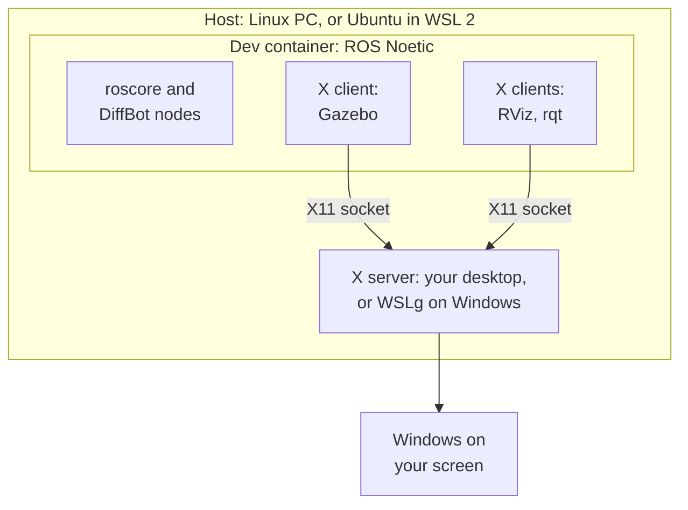

# Development Environment

The diffbot repository has a dev container for ROS 1 Noetic: a Docker image with Ubuntu 20.04, ROS Noetic, Gazebo 11, RViz and every dependency of the DiffBot packages. Every developer, and [CI](ci.md#dev-container-workflow), gets the same environment, on Linux and on Windows with WSL 2.

It's the recommended setup for the development PC. The robot's single board computer is still set up natively, see [Packages Setup](../packages/packages-setup.md).

## How the pieces fit together

A few terms first:

- **Host:** the computer that runs Docker Engine and the container. That's your Linux PC, or on Windows the Ubuntu that runs in [WSL 2](https://learn.microsoft.com/en-us/windows/wsl/) (Windows Subsystem for Linux). "On the host" means in a terminal of that Linux, not inside the container.
- **Container:** a separate Ubuntu 20.04 with ROS Noetic that runs on the host ([what is a container](https://docs.docker.com/get-started/docker-concepts/the-basics/what-is-a-container/)). A *dev container* is a container set up for development, described by a `devcontainer.json` file ([containers.dev](https://containers.dev/)). Your clone of the diffbot repository is shared with it, so you edit files on the host and build and run them in the container.
- **X server and X clients:** Linux GUI programs use the [X Window System](https://www.x.org/releases/current/doc/man/man7/X.7.xhtml) (X11). The *X server* is the program that draws windows on your screen, so it runs where the screen is. The programs that want windows, like RViz, Gazebo and rqt, are *X clients*: each one connects to the X server and tells it what to draw. One X server serves many clients, and the clients may run somewhere else, for example in the container. The naming feels backwards at first: the server is on your desk, and the apps are its clients.
- **Which X server:** on a Linux desktop, the desktop's own (Xwayland on [Wayland](https://wayland.freedesktop.org/) desktops). On Windows, [WSLg](https://github.com/microsoft/wslg) (Windows Subsystem for Linux GUI, part of WSL 2 on Windows 11 and on Windows 10 build 19044 or later, see the [prerequisites](https://learn.microsoft.com/en-us/windows/wsl/tutorials/gui-apps)) is the X server for Linux programs and shows their windows on the Windows desktop.

**Simulation, no robot needed:** everything runs in the container. Gazebo simulates the robot, RViz shows what it sees. They are X clients, and their windows appear on your screen through the host's X server (see [GUI apps](dev-container-internals.md#gui-apps-x11-and-wslg)):



**With the real robot:** the robot runs ROS natively on its Raspberry Pi (see [Packages Setup](../packages/packages-setup.md)), and together with the container on your PC it forms one ROS network, with the ROS master on the PC. RViz, mapping and navigation run on the PC. How the PC and the robot connect is described in [ROS Network Setup](../processing_units/ros-network-setup.md).

## Requirements

### Docker on the host

The dev container runs on [Docker Engine](https://docs.docker.com/engine/), the part of Docker that builds images and runs containers. There are two ways to get it: install Docker Engine directly in your Linux (on Windows, in the Ubuntu in WSL 2), or install Docker Desktop, an app that brings its own Docker Engine. Use one of them, not both. Docker Engine is the tested setup.

=== "Docker Engine (tested)"

    Install Docker Engine as described in Docker's guide [Install Docker Engine on Ubuntu](https://docs.docker.com/engine/install/ubuntu/), with Docker's apt repository. This works the same in the Ubuntu in WSL 2.

    Ubuntu's own packages work too, and this setup was tested with them (Docker 29 on Ubuntu 24.04). Docker calls them unofficial, and they can be older than Docker's releases:

    ```console
    sudo apt install docker.io docker-buildx
    ```

    Either way, then follow Docker's [post-installation steps](https://docs.docker.com/engine/install/linux-postinstall/), so you can use Docker without `sudo`:

    ```console
    sudo usermod -aG docker $USER
    ```

    Log out and in again so the new `docker` group applies. On WSL 2, run `wsl --shutdown` in Windows PowerShell and open Ubuntu again. Docker runs as a systemd service, which WSL turns on by default for current Ubuntu versions ([systemd in WSL](https://learn.microsoft.com/en-us/windows/wsl/systemd)).

=== "Docker Desktop (untested)"

    [Docker Desktop](https://docs.docker.com/desktop/) is an app for Windows, macOS and Linux that runs Docker Engine in its own virtual machine. On Windows, that's a separate WSL distribution called `docker-desktop`, and its [WSL integration](https://docs.docker.com/desktop/features/wsl/) makes the `docker` command available in your Ubuntu. Uninstall Docker Engine from your Ubuntu first, because the two conflict.

    Two things are different from Docker Engine:

    - The container's "host" is Docker Desktop's virtual machine, not your Ubuntu. Its host network, which this setup uses, is an opt-in feature from version 4.34 (Settings → Resources → Network → **Enable host networking**) and only carries TCP and UDP ([Docker docs](https://docs.docker.com/engine/network/drivers/host/#docker-desktop)).
    - Docker Desktop is free for personal use, education, non-commercial open source projects and small businesses. Larger companies need a paid subscription ([Docker Desktop license](https://docs.docker.com/subscription-billing/desktop-license/)).

    Docker Desktop isn't tested with this setup, and especially not with the robot.

### A way to start the container

[VS Code](https://code.visualstudio.com/) with the [Dev Containers extension](https://marketplace.visualstudio.com/items?itemName=ms-vscode-remote.remote-containers) is the easiest. The [Dev Container CLI](https://github.com/devcontainers/cli) works from a terminal (`npm install -g @devcontainers/cli`, which needs Node.js). Plain Docker works too. All three are shown under [Usage](#usage).

### For windows like RViz and Gazebo

=== "Linux"

    Install `xauth` on the host:

    ```console
    sudo apt install xauth
    ```

    With the usual cookie-based setup, the X server only accepts clients that present the display's *cookie*. In X11, a cookie is a secret: a random 128-bit value that your desktop creates when you log in. Clients without it, for example other users' programs, can't draw on your screen or read it. Any client that has the cookie can connect, which is how the container gets access ([X security](https://www.x.org/releases/current/doc/man/man7/Xsecurity.7.xhtml)). It has nothing to do with web cookies. [`xauth`](https://www.x.org/releases/current/doc/man/man1/xauth.1.xhtml) is the standard tool for these cookies, and the setup uses it to hand yours to the container (see [GUI apps](dev-container-internals.md#gui-apps-x11-and-wslg)).

=== "Windows (WSL 2)"

    Nothing to install: WSLg shows the windows on the Windows desktop. It's part of WSL 2 on Windows 11 and on Windows 10 build 19044 or later (see the [prerequisites](https://learn.microsoft.com/en-us/windows/wsl/tutorials/gui-apps)).

### Real robot from Windows (optional)

Only needed if your PC runs Windows and you want to connect to the real robot. By default, WSL 2 sits behind its own network translation (NAT), so the robot can't connect to your PC, and ROS 1 needs connections in both directions. WSL's *mirrored networking* removes that barrier. Why, how to set it up and how to test it: [Work machine on Windows (WSL 2)](../processing_units/ros-network-setup.md#work-machine-on-windows-wsl-2).

You don't need it on Linux, where the container uses the PC's own network address. You also don't need it for simulation, because then all ROS nodes run in the container on your PC, and no other device has to connect to it.

!!! warning "Not tested with the robot yet"
    Mirrored networking is Microsoft's fix for exactly this problem, but nobody has tested this setup with DiffBot or Remo yet.

## Usage

Clone the repository on the host first:

```console
git clone https://github.com/ros-mobile-robots/diffbot.git
cd diffbot
```

=== "VS Code"

    Open the `diffbot` folder and choose **Reopen in Container** (or run **Dev Containers: Reopen in Container** from the command palette). The first start builds the image and the workspace, which takes a few minutes.

    VS Code's window stays on your PC and works with a VS Code Server in the container, see [VS Code and the container](dev-container-internals.md#vs-code-and-the-container).

=== "Dev Container CLI"

    ```console
    devcontainer up --workspace-folder . --config .devcontainer/noetic/devcontainer.json
    devcontainer exec --workspace-folder . --config .devcontainer/noetic/devcontainer.json bash
    ```

=== "Plain Docker"

    The image's user has UID 1000, which is the usual UID of the first user on Linux. With another UID, use VS Code or the CLI, which adapt it (see [Creating the container](dev-container-internals.md#creating-the-container)).

    ```console
    docker build -f .devcontainer/noetic/Dockerfile -t diffbot:noetic .
    bash .devcontainer/noetic/host-x11.sh
    docker run -it --rm --net=host -v /tmp/.X11-unix:/tmp/.X11-unix -e DISPLAY \
      -e XAUTHORITY=/home/ros/catkin_ws/src/diffbot/.devcontainer/noetic/.x11/xauth \
      -v "$PWD":/home/ros/catkin_ws/src/diffbot diffbot:noetic \
      bash -c "bash src/diffbot/.devcontainer/noetic/setup.sh && bash"
    ```

Inside the container, the workspace is `~/catkin_ws`, already built and sourced. This happens automatically: the image adds `source /opt/ros/noetic/setup.bash` to `~/.bashrc`, and when the container is created, [`setup.sh`]({{ diffbot_repo_url }}/.devcontainer/noetic/setup.sh) builds the workspace with `catkin build` and adds `source ~/catkin_ws/devel/setup.bash`. Every new interactive Bash terminal in the container reads `~/.bashrc`, so ROS and the workspace are ready there. Scripts and other non-interactive commands don't read it; they need to source the two files themselves. Your clone is mounted at `~/catkin_ws/src/diffbot`, so edits on the host show up in the container and the other way round. For example, start the simulation with Gazebo and RViz:

```console
roslaunch diffbot_control diffbot.launch
```

After changing code, rebuild with `catkin build` in `~/catkin_ws`.

How the image, the container, VS Code, the network and the display access work in detail: [How the Dev Container Works](dev-container-internals.md).

## Updating

- **New ROS or system dependency:** add it to the package's `package.xml`. Then rebuild the container: **Dev Containers: Rebuild Container** in VS Code, or with the CLI, from the diffbot folder:

    ```console
    devcontainer up --workspace-folder . --config .devcontainer/noetic/devcontainer.json --remove-existing-container
    ```

- **New source dependency:** add the repository to [`diffbot_dev.repos`]({{ diffbot_repo_url }}/diffbot_dev.repos), and to the robot's `.repos` file if the robot needs it too.
- **Tools in the image:** add them to the `apt-get install` list in the Dockerfile.

## Troubleshooting

| Problem | Fix |
|:--------|:----|
| `permission denied` on `/var/run/docker.sock` | Your user isn't in the `docker` group yet. Add it, then log out and in (WSL 2: `wsl --shutdown`). |
| `No protocol specified` or `cannot open display` on native Linux | Install `xauth` on the host and recreate the container (see [GUI apps](dev-container-internals.md#gui-apps-x11-and-wslg)). Check that `echo $DISPLAY` shows a display on the host. |
| Files in the clone belong to another user (plain Docker) | Your UID isn't 1000. Use VS Code or the CLI, which adapt the UID (see [Creating the container](dev-container-internals.md#creating-the-container)). |
| Gazebo is slow | The container renders without GPU acceleration, which isn't set up yet ([diffbot#103](https://github.com/ros-mobile-robots/diffbot/issues/103)). |
