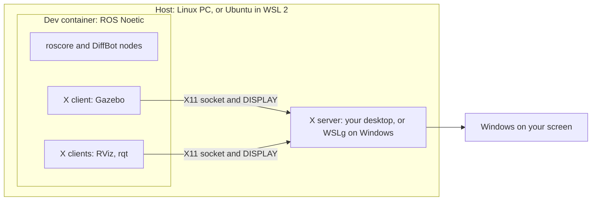
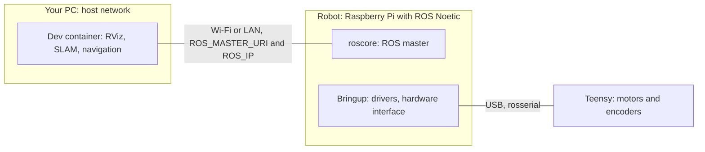

# Dev Container

The diffbot repository has a dev container for ROS 1 Noetic: a Docker image with Ubuntu 20.04, ROS Noetic, Gazebo 11, RViz and every dependency of the DiffBot packages. Every developer, and [CI](ci.md#dev-container-workflow), gets the same environment, on Linux and on Windows with WSL 2.

It's the recommended setup for the development PC. The robot's single board computer is still set up natively, see [Packages Setup](../packages/packages-setup.md).

## How the pieces fit together

A few terms first:

- **Host:** the computer that runs Docker and the container. That's your Linux PC, or on Windows the Ubuntu that runs in [WSL 2](https://learn.microsoft.com/en-us/windows/wsl/) (Windows Subsystem for Linux). "On the host" means in a terminal of that Linux, not inside the container.
- **Container:** a separate Ubuntu 20.04 with ROS Noetic that runs on the host ([what is a container](https://docs.docker.com/get-started/docker-concepts/the-basics/what-is-a-container/)). A *dev container* is a container set up for development, described by a `devcontainer.json` file ([containers.dev](https://containers.dev/)). Your clone of the diffbot repository is shared with it, so you edit files on the host and build and run them in the container.
- **X server and X clients:** Linux GUI programs use the [X Window System](https://www.x.org/releases/current/doc/man/man7/X.7.xhtml) (X11). The *X server* is the program that draws windows on your screen, so it runs where the screen is. The programs that want windows, like RViz, Gazebo and rqt, are *X clients*: each one connects to the X server and tells it what to draw. One X server serves many clients, and the clients may run somewhere else, for example in the container. The naming feels backwards at first: the server is on your desk, and the apps are its clients.
- **Which X server:** on a Linux desktop, the desktop's own (Xwayland on [Wayland](https://wayland.freedesktop.org/) desktops). On Windows, [WSLg](https://github.com/microsoft/wslg) (Windows Subsystem for Linux GUI, part of WSL 2 on Windows 11 and updated Windows 10) is the X server for Linux programs and shows their windows on the Windows desktop.

How VS Code works with a dev container: its window runs on your PC, while a VS Code server, the terminals, the build and the running programs are in the container. The source code stays on your PC and is mounted into the container.

<figure>
  
  <figcaption>Diagram: <a href="https://code.visualstudio.com/docs/devcontainers/containers">Visual Studio Code documentation</a>, Microsoft, <a href="https://creativecommons.org/licenses/by/3.0/us/">CC BY 3.0 US</a></figcaption>
</figure>

**Simulation, no robot needed:** everything runs in the container. Gazebo simulates the robot, RViz shows what it sees. They are X clients, and their windows appear on your screen through the host's X server:



**With the real robot:** the robot runs ROS natively on its Raspberry Pi (see [Packages Setup](../packages/packages-setup.md)), and the container on your PC joins its ROS network. RViz, mapping and navigation can then run on the PC:



The container shares the host's network (see [Network](#network)), and the windows reach your screen as described in [GUI apps](#gui-apps-x11-and-wslg).

## Requirements

- **Docker on the host:** [Docker Engine](https://docs.docker.com/engine/) on Linux or in WSL 2, or [Docker Desktop](https://docs.docker.com/desktop/). On Ubuntu, including the Ubuntu in WSL 2:

    ```console
    sudo apt install docker.io docker-compose-v2 docker-buildx
    sudo usermod -aG docker $USER
    ```

    Log out and in again so the new `docker` group applies (see Docker's [post-installation steps](https://docs.docker.com/engine/install/linux-postinstall/)). On WSL 2, run `wsl --shutdown` in Windows PowerShell and open Ubuntu again.

- **A way to start the container:** [VS Code](https://code.visualstudio.com/) with the [Dev Containers extension](https://marketplace.visualstudio.com/items?itemName=ms-vscode-remote.remote-containers), the [Dev Container CLI](https://github.com/devcontainers/cli) (`npm install -g @devcontainers/cli`), or plain Docker.
- **For windows like RViz and Gazebo:**
    - On Windows with WSL 2: nothing to install, WSLg shows them on the Windows desktop.
    - On a Linux desktop: install `xauth` on the host (`sudo apt install xauth`). The X server only accepts clients that present the display's *cookie*. In X11, a cookie is a secret: a random 128-bit value that your desktop creates when you log in, so no other user or program can draw on your screen or read it ([X security](https://www.x.org/releases/current/doc/man/man7/Xsecurity.7.xhtml)). It has nothing to do with web cookies. [`xauth`](https://www.x.org/releases/current/doc/man/man1/xauth.1.xhtml) is the standard tool for these cookies, and the setup uses it to hand yours to the container (see [GUI apps](#gui-apps-x11-and-wslg)).
- **For the real robot from WSL 2:** WSL's mirrored networking, so the robot can reach your PC (see [Network](#network)). Simulation doesn't need it.

## Usage

Clone the repository on the host first:

```console
git clone https://github.com/ros-mobile-robots/diffbot.git
cd diffbot
```

=== "VS Code"

    Open the `diffbot` folder and choose **Reopen in Container** (or run **Dev Containers: Reopen in Container** from the command palette). The first start builds the image and the workspace, which takes a few minutes.

=== "Dev Container CLI"

    ```console
    devcontainer up --workspace-folder . --config .devcontainer/noetic/devcontainer.json
    devcontainer exec --workspace-folder . --config .devcontainer/noetic/devcontainer.json bash
    ```

=== "Plain Docker"

    The image's user has UID 1000, which is the usual UID of the first user on Linux. With another UID, use VS Code or the CLI, which adapt it (see [Creating the container](#creating-the-container)).

    ```console
    docker build -f .devcontainer/noetic/Dockerfile -t diffbot:noetic .
    bash .devcontainer/noetic/host-x11.sh
    docker run -it --rm --net=host -v /tmp/.X11-unix:/tmp/.X11-unix -e DISPLAY \
      -e XAUTHORITY=/home/ros/catkin_ws/src/diffbot/.devcontainer/noetic/.x11/xauth \
      -v "$PWD":/home/ros/catkin_ws/src/diffbot diffbot:noetic \
      bash -c "bash src/diffbot/.devcontainer/noetic/setup.sh && bash"
    ```

Inside the container, the workspace is `~/catkin_ws`, already built and sourced. This happens automatically: the image adds `source /opt/ros/noetic/setup.bash` to `~/.bashrc`, and when the container is created, [`setup.sh`]({{ diffbot_repo_url }}/.devcontainer/noetic/setup.sh) builds the workspace with `catkin build` and adds `source ~/catkin_ws/devel/setup.bash`. Every new terminal in the container reads `~/.bashrc`, so ROS and the workspace are ready. Your clone is mounted at `~/catkin_ws/src/diffbot`, so edits on the host show up in the container and the other way round. For example, start the simulation with Gazebo and RViz:

```console
roslaunch diffbot_control diffbot.launch
```

After changing code, rebuild with `catkin build` in `~/catkin_ws`.

## How the dev container works

What the files in diffbot's `.devcontainer/noetic/` folder do, and how the image, the container, the network and the display access are set up.

| File in diffbot | Purpose |
|:----------------|:--------|
| [`.devcontainer/noetic/Dockerfile`]({{ diffbot_repo_url }}/.devcontainer/noetic/Dockerfile) | The image: ROS, Gazebo, tools and the packages' dependencies |
| [`.devcontainer/noetic/devcontainer.json`]({{ diffbot_repo_url }}/.devcontainer/noetic/devcontainer.json) | How the container runs: mounts, network, display, what runs when |
| [`.devcontainer/noetic/setup.sh`]({{ diffbot_repo_url }}/.devcontainer/noetic/setup.sh) | Runs once in a new container: fetches repositories, installs dependencies, builds the workspace |
| [`.devcontainer/noetic/host-x11.sh`]({{ diffbot_repo_url }}/.devcontainer/noetic/host-x11.sh) | Runs on the host before the container starts: prepares the display access |
| [`.dockerignore`]({{ diffbot_repo_url }}/.dockerignore) | Keeps `.git` and the X11 cookie out of the image build |
| [`.github/workflows/devcontainer.yml`]({{ diffbot_repo_url }}/.github/workflows/devcontainer.yml) | CI builds the same container on every pull request |

### The image

The [Dockerfile]({{ diffbot_repo_url }}/.devcontainer/noetic/Dockerfile) starts from [`osrf/ros:noetic-desktop-full`](https://hub.docker.com/r/osrf/ros), the official ROS image with ROS Noetic, Gazebo 11 and RViz on Ubuntu 20.04. On top it installs [catkin tools](https://catkin-tools.readthedocs.io/), [vcstool](https://github.com/dirk-thomas/vcstool) and a few shell tools, and creates the user `ros` (UID 1000, sudo without password).

The packages' dependencies are installed with [rosdep](http://wiki.ros.org/rosdep) from their `package.xml` files. The Dockerfile has two [stages](https://docs.docker.com/build/building/multi-stage/) for this:

1. The first stage copies the repository and keeps only the `package.xml` files.
2. The second stage copies just those files and runs `rosdep install` on them.

Docker reuses a build step as long as its inputs don't change ([build cache](https://docs.docker.com/build/cache/)). Because the rosdep step only sees the `package.xml` files, a change to the source code doesn't reinstall the dependencies: the image rebuilds in about 2 seconds. A change to a `package.xml` reinstalls them, which takes about 40 seconds.

!!! note "Why the old Dockerfile was replaced"
    The repository used to have a `Dockerfile` in its root. It stopped building because it added the ROS package source a second time, with ROS's old signing key, which expired in 2025 (`EXPKEYSIG F42ED6FBAB17C654`; see the [ROS signing key migration guide](https://discourse.ros.org/t/ros-signing-key-migration-guide/43937)). The official ROS images already have the ROS package source set up with the current key, so the new Dockerfile doesn't add it again.

### Creating the container

When the container is created, the [devcontainer.json]({{ diffbot_repo_url }}/.devcontainer/noetic/devcontainer.json) settings apply in this order (see the dev container [lifecycle scripts](https://containers.dev/implementors/json_reference/#lifecycle-scripts)):

1. **On the host:** [`host-x11.sh`]({{ diffbot_repo_url }}/.devcontainer/noetic/host-x11.sh) prepares the display access (see [GUI apps](#gui-apps-x11-and-wslg) below).
2. **Build and start:** the image is built, and the container starts with your clone mounted at `~/catkin_ws/src/diffbot`. VS Code and the CLI change the UID and GID of the user `ros` to yours, so files created in the container belong to you on the host ([`updateRemoteUserUID`](https://containers.dev/implementors/json_reference/)).
3. **In the container:** [`setup.sh`]({{ diffbot_repo_url }}/.devcontainer/noetic/setup.sh) runs once. It imports `rplidar_ros` and `remo_description` with [`vcs import`](https://github.com/dirk-thomas/vcstool) from [`diffbot_dev.repos`]({{ diffbot_repo_url }}/diffbot_dev.repos), runs `rosdep install` again for anything added since the image was built, builds the workspace with `catkin build` and adds the workspace to `~/.bashrc`.

`remo_description` contains empty placeholder STL files. To see Remo's meshes in RViz and Gazebo, get the real files as described in its [README](https://github.com/ros-mobile-robots/remo_description#stl-mesh-files). DiffBot's own meshes are part of `diffbot_description`.

### Network

The container uses the host's network ([`--network=host`](https://docs.docker.com/engine/network/drivers/host/)): it has no network of its own, and ROS nodes in the container are reachable at the host's IP address. For the real robot, set [`ROS_MASTER_URI` and `ROS_IP`](http://wiki.ros.org/ROS/EnvironmentVariables) as described in [ROS Network Setup](../processing_units/ros-network-setup.md).

ROS 1 nodes connect to each other directly, in both directions: the machines need "full bi-directional connectivity, on all ports" ([ROS NetworkSetup](http://wiki.ros.org/ROS/NetworkSetup)). So the robot must be able to reach your PC too:

- **Linux PC:** the host's IP address is the PC's address on your network, so this works as usual.
- **Windows with WSL 2:** by default, WSL 2 sits behind its own network translation (NAT) with a private IP address, and devices on your network can't connect to it. Switch on [mirrored networking](https://learn.microsoft.com/en-us/windows/wsl/networking#mirrored-mode-networking) (Windows 11 22H2 or later): add `networkingMode=mirrored` under `[wsl2]` in `%UserProfile%\.wslconfig` ([WSL settings](https://learn.microsoft.com/en-us/windows/wsl/wsl-config)) and run `wsl --shutdown`. WSL then shares Windows' network addresses, and the robot can reach it. Windows' Hyper-V firewall may also need to allow incoming connections, as described on that page. This setup isn't tested with the robot yet.

### GUI apps: X11 and WSLg

The container has no screen of its own; it's "headless". Linux GUI apps don't need one: a program like RViz is an X client: it connects to an X server and sends it what to draw, and the X server shows the window ([X Window System](https://www.x.org/releases/current/doc/man/man7/X.7.xhtml)). The container borrows the host's X server. It gets the socket folder `/tmp/.X11-unix`, through which clients reach the X server, and the [`DISPLAY`](https://www.x.org/releases/current/doc/man/man7/X.7.xhtml#heading5) variable, which says which display to use. So RViz runs in the container, but its window opens on your desktop like any other.

On Windows, [WSLg](https://github.com/microsoft/wslg) provides the X server and accepts local clients without a cookie, so nothing else is needed.

??? info "How WSLg shows Linux windows on Windows"
    An X11 program like RViz connects through the X socket to XWayland, WSLg's X server. Weston, a Wayland compositor, collects the windows and sends them over a remote desktop (RDP) connection to Windows, which shows each one as a normal window. All of this runs in a small "system distro" next to your Ubuntu.

    <figure>
      
      <figcaption>Diagram: <a href="https://github.com/microsoft/wslg">WSLg</a>, Microsoft, <a href="https://github.com/microsoft/wslg/blob/main/LICENSE">MIT License</a></figcaption>
    </figure>

A native Linux desktop (X11, or Wayland with Xwayland) only accepts clients that present the display's cookie (`MIT-MAGIC-COOKIE-1`, see [Requirements](#requirements)). [`host-x11.sh`]({{ diffbot_repo_url }}/.devcontainer/noetic/host-x11.sh) copies that cookie for the container, the method from the [ROS Docker GUI tutorial](http://wiki.ros.org/docker/Tutorials/GUI):

```bash
xauth nlist "$DISPLAY" | sed -e 's/^..../ffff/' | xauth -f "$tmp_file" nmerge -
```

- **Wildcard address:** `xauth nlist` prints the cookie entries for the display. Their first four characters are the address family; `ffff` changes it to "wild", so the cookie matches any hostname, including the container's.
- **Where the cookie goes:** the script writes the cookie to `.devcontainer/noetic/.x11/xauth`, through a temporary file and a rename. Git and Docker ignore that folder.
- **How the container finds it:** the container reads the cookie through the workspace mount (`XAUTHORITY` points there). A refreshed cookie is therefore visible in a running container too.

This avoids [`xhost +`](https://www.x.org/releases/current/doc/man/man1/xhost.1.xhtml), which switches off the access control, so every local user and process could connect to your display. The ROS tutorial also calls that "not the safest way".

## Updating

- **New ROS or system dependency:** add it to the package's `package.xml`. Then rebuild the container: **Dev Containers: Rebuild Container** in VS Code, or with the CLI, from the diffbot folder:

    ```console
    devcontainer up --workspace-folder . --config .devcontainer/noetic/devcontainer.json --remove-existing-container
    ```

- **New source dependency:** add the repository to [`diffbot_dev.repos`]({{ diffbot_repo_url }}/diffbot_dev.repos), and to the robot's `.repos` file if the robot needs it too.
- **Tools in the image:** add them to the `apt-get install` list in the Dockerfile.

## Troubleshooting

| Problem | Fix |
|:--------|:----|
| `permission denied` on `/var/run/docker.sock` | Your user isn't in the `docker` group yet. Add it, then log out and in (WSL 2: `wsl --shutdown`). |
| `No protocol specified` or `cannot open display` on native Linux | Install `xauth` on the host and recreate the container (see [GUI apps](#gui-apps-x11-and-wslg)). Check that `echo $DISPLAY` shows a display on the host. |
| Files in the clone belong to another user (plain Docker) | Your UID isn't 1000. Use VS Code or the CLI, which adapt the UID (see [Creating the container](#creating-the-container)). |
| Gazebo is slow | The container renders without GPU acceleration, which isn't set up yet. |
