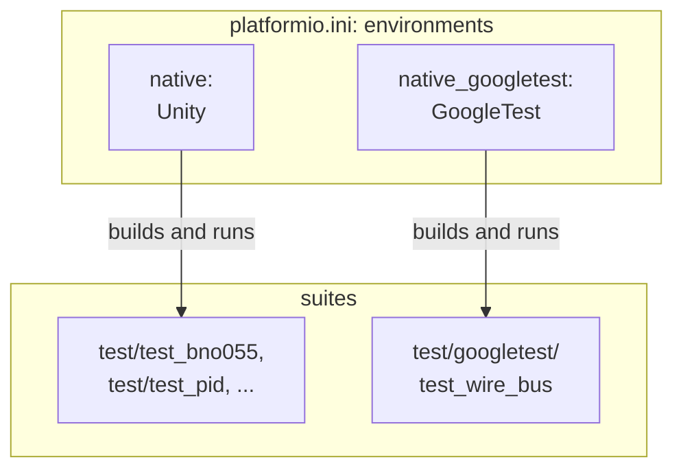

# Firmware Unit Tests

A unit test runs one small part of the code with chosen inputs and checks the result. The unit tests of the Teensy firmware run on your PC, without a Teensy. The tested code talks to stand-ins for the hardware and for the ROS connection, which the tests call fakes. [PlatformIO](https://platformio.org/), the tool that builds the firmware, also builds the tests into programs for the PC and runs them ([PlatformIO's unit testing](https://docs.platformio.org/en/latest/advanced/unit-testing/index.html)).

This page runs one test first. Then it explains which of the two test frameworks a new test uses, and how to write a test suite. CI runs every suite on every pull request ([What CI runs](ci.md#firmware-unit-tests) on the Testing and CI page).

## Run the tests

### One test

The goal of this first run is to check that a register write sends the register byte followed by the value byte. The test `WireBusTest.WriteRegisterSendsRegisterAndValue` checks exactly that, for the firmware's I2C bus code. Run it in the [firmware container](firmware-container.md), which needs only Docker, from the root folder of your diffbot clone:

```console
.docker/firmware/run.sh pio test -e native_googletest \
  --filter googletest/test_wire_bus \
  --program-arg=--gtest_filter=WireBusTest.WriteRegisterSendsRegisterAndValue
```

The test passed when PlatformIO prints its name with `[PASSED]`, and the last line counts one test case that succeeded:

```console
WireBusTest.WriteRegisterSendsRegisterAndValue	[PASSED]
…
================== 1 test cases: 1 succeeded in 00:00:00.500 ==================
```

The first run downloads what the tests need from PlatformIO's registry, so it needs the internet. The libraries Unity, rosserial and GoogleTest are part of that download and land in `diffbot_firmware/.pio/libdeps`. Later runs work without the internet.

The command has four parts:

- **`.docker/firmware/run.sh`:** our script that runs a command in the firmware container, in the folder `diffbot_firmware` ([the script](firmware-container.md#the-script) on the Firmware Container page).
- **`pio test -e native_googletest`:** PlatformIO's test command, with the environment that builds the GoogleTest suites. An environment is a section of `platformio.ini` that says what to build and how.
- **`--filter googletest/test_wire_bus`:** the PlatformIO test suite, a folder below `diffbot_firmware/test` whose name starts with `test_`. PlatformIO builds each of these folders into one test program. `--filter` selects folders, not single tests.
- **`--program-arg=--gtest_filter=…`:** an option that PlatformIO passes on to the test program ([`pio test`'s options](https://docs.platformio.org/en/latest/core/userguide/cmd_test.html)). GoogleTest's option `--gtest_filter` runs only the tests whose full name matches ([Running a Subset of the Tests](https://google.github.io/googletest/advanced.html#running-a-subset-of-the-tests)).

A test's full name has two parts. GoogleTest groups the tests of a program into GoogleTest test suites, and the name before the dot is that group, here `WireBusTest`. The name after the dot is the test. The program of `googletest/test_wire_bus` has ten tests in two GoogleTest test suites, `WireBusTest` and `ShortReads/WireBusShortReadTest`. PlatformIO counts each test as a test case.

### All suites, one environment or one suite

Each of these commands runs more than one test. Run them from the same folder:

- **Every suite, as CI runs them:**

    ```console
    .docker/firmware/run.sh pio test -e native -e native_googletest
    ```

- **The Unity suites only:**

    ```console
    .docker/firmware/run.sh pio test -e native
    ```

- **The GoogleTest suites only:**

    ```console
    .docker/firmware/run.sh pio test -e native_googletest
    ```

- **One Unity suite,** here the PID controller's:

    ```console
    .docker/firmware/run.sh pio test -e native --filter test_pid
    ```

- **One GoogleTest suite,** here the I2C bus code's:

    ```console
    .docker/firmware/run.sh pio test -e native_googletest --filter googletest/test_wire_bus
    ```

PlatformIO prints each test's name with `[PASSED]` or `[FAILED]`. At the end, a summary lists each PlatformIO test suite with its status, and the last line counts the test cases: 99 for every suite.

??? example "The output of every suite: the GoogleTest suite's tests and the summary"

    ```console
    Processing googletest/test_wire_bus in native_googletest environment
    --------------------------------------------------------------------------------
    Building...
    Testing...
    WireBusTest.WriteRegisterSendsRegisterAndValue	[PASSED]
    WireBusTest.WriteRegisterFailsWhenTheAddressIsNotAcknowledged	[PASSED]
    WireBusTest.WriteRegisterFailsWhenTheAddressIsNotAcknowledgedAfterASuccessfulWrite	[PASSED]
    WireBusTest.ReadRegistersUsesARepeatedStart	[PASSED]
    WireBusTest.ReadRegistersReturnsAllBytesOfASample	[PASSED]
    WireBusTest.ReadRegistersFailsWithoutAReadRequestWhenTheRegisterWriteFails	[PASSED]
    ShortReads/WireBusShortReadTest.ReadRegistersFailsAndDrainsTheBytes/ReportedShortAllBytesThere	[PASSED]
    ShortReads/WireBusShortReadTest.ReadRegistersFailsAndDrainsTheBytes/BothShort	[PASSED]
    ShortReads/WireBusShortReadTest.ReadRegistersFailsAndDrainsTheBytes/ReportedInFullOneByteMissing	[PASSED]
    ShortReads/WireBusShortReadTest.ReadRegistersFailsAndDrainsTheBytes/ReportedOneShortAllBytesThere	[PASSED]
    ---- native_googletest:googletest/test_wire_bus [PASSED] Took 1.97 seconds ----

    =================================== SUMMARY ===================================
    Environment        Test                               Status    Duration
    -----------------  ---------------------------------  --------  ------------
    native             test_wheel_control                 PASSED    00:00:01.369
    native             test_synced_node_handle            PASSED    00:00:00.985
    native             test_ros_wheel_command_subscriber  PASSED    00:00:01.128
    native             test_pid                           PASSED    00:00:00.594
    native             test_imu_publisher                 PASSED    00:00:01.079
    native             test_command_timeout               PASSED    00:00:00.606
    native             test_bno055                        PASSED    00:00:00.679
    native_googletest  googletest/test_wire_bus           PASSED    00:00:01.970
    ================= 99 test cases: 99 succeeded in 00:00:08.410 =================
    ```

With PlatformIO installed on your PC instead, in the virtual environment that [Firmware Container](firmware-container.md) sets up, call that environment's `pio` in the folder `diffbot_firmware`: `~/.venvs/platformio/bin/pio test -e native -e native_googletest`. That route needs a C++17 compiler on the PC. It wasn't tested with the GoogleTest environment.

### What a failed test looks like

To see what a failure looks like, change the tested code on purpose. `readRegisters()` in [`wire_bus.h`]({{ firmware_tests_src_url }}/diffbot_firmware/lib/imu/wire_bus.h#L40) compares two counts with the requested `length`: the count that `requestFrom()` reports, and the bytes that arrived, `wire_.available()`. This edit replaces both comparisons with one comparison of the two counts with each other:

```diff
-if (wire_.requestFrom(address, (uint8_t)length) != length || wire_.available() != (int)length)
+const int reported = wire_.requestFrom(address, (uint8_t)length);
+if (reported != wire_.available())
```

With that edit, `pio test -e native_googletest --filter googletest/test_wire_bus` fails in one case, `BothShort`:

!!! failure "`BothShort` failed"

    `readRegisters()` returned `true`. The test expects `false`.

    The read requested 18 bytes. `requestFrom()` reported 4, and 4 bytes arrived. The changed check finds 4 equal to 4.

PlatformIO marks the case with `[FAILED]` and names the line of the failed check, `test_wire_bus.cpp:224`. The other nine tests pass. The summary counts 11 test cases: the ten tests, and one more with the status `ERRORED` for the program's exit status.

??? example "PlatformIO's output of the failed run"

    ```console
    WireBusTest.WriteRegisterSendsRegisterAndValue	[PASSED]
    WireBusTest.WriteRegisterFailsWhenTheAddressIsNotAcknowledged	[PASSED]
    WireBusTest.WriteRegisterFailsWhenTheAddressIsNotAcknowledgedAfterASuccessfulWrite	[PASSED]
    WireBusTest.ReadRegistersUsesARepeatedStart	[PASSED]
    WireBusTest.ReadRegistersReturnsAllBytesOfASample	[PASSED]
    WireBusTest.ReadRegistersFailsWithoutAReadRequestWhenTheRegisterWriteFails	[PASSED]
    ShortReads/WireBusShortReadTest.ReadRegistersFailsAndDrainsTheBytes/ReportedShortAllBytesThere	[PASSED]
    test/googletest/test_wire_bus/test_wire_bus.cpp:224: ShortReads/WireBusShortReadTest.ReadRegistersFailsAndDrainsTheBytes/BothShort: Failure	[FAILED]
    ShortReads/WireBusShortReadTest.ReadRegistersFailsAndDrainsTheBytes/ReportedInFullOneByteMissing	[PASSED]
    ShortReads/WireBusShortReadTest.ReadRegistersFailsAndDrainsTheBytes/ReportedOneShortAllBytesThere	[PASSED]
    Program received signal SIGHUP (Hangup)
    ---- native_googletest:googletest/test_wire_bus [ERRORED] Took 0.51 seconds ----

    =================================== SUMMARY ===================================
    Environment        Test                      Status    Duration
    -----------------  ------------------------  --------  ------------
    native_googletest  googletest/test_wire_bus  ERRORED   00:00:00.512

    ============= 11 test cases: 1 failed, 9 succeeded in 00:00:00.512 =============
    ```

With `-v`, PlatformIO also prints GoogleTest's own output, which says why the check failed:

??? example "GoogleTest's output for the case `BothShort`, with `-v`"

    ```console
    [ RUN      ] ShortReads/WireBusShortReadTest.ReadRegistersFailsAndDrainsTheBytes/BothShort
    test/googletest/test_wire_bus/test_wire_bus.cpp:224: Failure
    Value of: bus_.readRegisters(DEVICE_ADDRESS, READ_REGISTER, data.data(), data.size())
      Actual: true
    Expected: false

    [  FAILED  ] ShortReads/WireBusShortReadTest.ReadRegistersFailsAndDrainsTheBytes/BothShort, where GetParam() = requestFrom() reports 4 bytes, 4 bytes arrive (0 ms)
    ```

GoogleTest's output has two parts to read:

- **The check that failed:** its file and line, the expression, its value and the expected value.
- **The test's name:** the name ends with the case, `BothShort`, and the case's values follow `where GetParam() =`. The other three cases ran too, and passed.

After the tests of a suite with a failure, PlatformIO 6.2.0 prints `Program received signal SIGHUP (Hangup)` and gives the suite the status `ERRORED`. In this run, no signal was sent. The test program ends with the exit status 1 when a test fails, and PlatformIO reads a nonzero status as a signal's number ([`raise_for_status()`](https://github.com/platformio/platformio-core/blob/v6.2.0/platformio/test/runners/readers/native.py#L116-L128) in PlatformIO 6.2.0). Signal 1 is SIGHUP. A program that really received the signal SIGHUP gets the same message. So the message doesn't tell you what went wrong: look for a failed check above it. A Unity suite with one failed test shows the same line.

Undo the edit before you go on.

## Which framework for a new test

The firmware's suites are written with two test frameworks, Unity and GoogleTest. A test framework is the library that provides the checks and reports which tests passed. Which framework a test uses depends on the code that it tests:

- **A new test of portable code:** GoogleTest. The suite's folder is `test/googletest/test_<name>/`, and the environment `native_googletest` runs it. Portable code is code that builds on the PC. That is the firmware's core, the logic that includes no Arduino, rosserial or other vendor library header ([Ports and adapters]({{ diffbot_repo_url }}/diffbot_firmware/README.md#ports-and-adapters) in the firmware's README). An adapter connects the core to a library or to the hardware, and most adapters need the Arduino core. An adapter that takes its library as a template argument, as `WireBusT` does below, is portable code too.
- **A test of the rosserial code:** Unity. Its three suites use rosserial's node handle with a fake serial port, and only the environment `native` has the rosserial library. Their folders are `test/test_<name>/`, and `native` runs them. The suites of the BNO055 driver, the command timeout, the PID controller and the wheel control are Unity suites too. A Unity suite of the core moves to GoogleTest when its code changes.
- **A test that has to run on the Teensy itself:** Unity. PlatformIO runs Unity on microcontrollers, and GoogleTest only on the PC and ESP boards ([GoogleTest in PlatformIO](https://docs.platformio.org/en/latest/advanced/unit-testing/frameworks/googletest.html)). The firmware has no such suite yet. The folders in `test` without the prefix `test_`, such as `test/encoders`, are sketches for the Teensy that you run by hand.

GoogleTest is a C++ framework. Tests that share a setup put it into a fixture, and a test that has to run with several values is written once and runs once per value. A failure names the value. GoogleTest also finds the tests by itself, while a Unity suite lists each test by hand. [Unity](https://github.com/ThrowTheSwitch/Unity) is a small framework written in C for microcontrollers ([Unity in PlatformIO](https://docs.platformio.org/en/latest/advanced/unit-testing/frameworks/unity.html)). Its checks are C macros, and the firmware's Unity suites are C++ files too. ROS uses GoogleTest for its C++ tests, in ROS 1 ([gtest](http://wiki.ros.org/gtest) on the ROS wiki) and in ROS 2 ([Writing Basic Tests with C++ with GTest](https://docs.ros.org/en/jazzy/Tutorials/Intermediate/Testing/Cpp.html)).

`test/googletest` holds one suite, `test_wire_bus`. It tests `WireBusT` ([`wire_bus.h`]({{ firmware_tests_src_url }}/diffbot_firmware/lib/imu/wire_bus.h)), the adapter that carries out the BNO055 driver's I2C transfers with Arduino's Wire library ([How the firmware reads it](../packages/imu/driver-bno055.md#how-the-firmware-reads-it) on the IMU page). `WireBusT` takes the Wire library's class as a template argument. On the Teensy that is Arduino's `TwoWire`. The suite passes its fake, `FakeWire`, so the adapter builds and runs on the PC too.

### How PlatformIO keeps the suites apart

One environment builds its suites with one framework. So the firmware has an environment for each framework, and each suite's folder decides which environment runs it:


```mermaid
graph TB
  subgraph ENVIRONMENTS [platformio.ini: environments]
    NATIVE[native:<br/>Unity]
    GOOGLETEST[native_googletest:<br/>GoogleTest]
  end
  subgraph SUITES [suites]
    UNITY_SUITES[test/test_bno055,<br/>test/test_pid, ...]
    GOOGLETEST_SUITES[test/googletest/<br/>test_wire_bus]
  end
  NATIVE -->|builds and runs| UNITY_SUITES
  GOOGLETEST -->|builds and runs| GOOGLETEST_SUITES
```

PlatformIO takes every folder below `test` whose name starts with `test_` as a PlatformIO test suite, and names the suite by its path: `test_pid`, or `googletest/test_wire_bus` ([Test Hierarchy](https://docs.platformio.org/en/latest/advanced/unit-testing/structure/hierarchy.html)). The settings `test_filter` and `test_ignore` of [`platformio.ini`]({{ firmware_tests_src_url }}/diffbot_firmware/platformio.ini) compare patterns with that path:

- **The section `[env]`:** sets `test_ignore = googletest/*`. Its options hold for every environment that doesn't set them itself ([Common `[env]`](https://docs.platformio.org/en/latest/projectconf/sections/env/index.html#common-env)). So the two Teensy environments and `native` ignore every suite below `test/googletest`.
- **`native`:** `test_framework = unity`, and `test_filter` lists its Unity suites by name.
- **`native_googletest`:** `test_framework = googletest`, `test_filter = googletest/*`, and its own `test_ignore = test_*`, which matches the Unity suites. A new GoogleTest suite needs no change of the file.

A `--filter` on the command line replaces the environment's `test_filter`, but not its `test_ignore`. So a call that names a suite for the wrong environment builds nothing with the wrong framework: `pio test -e native --filter "googletest/*"` runs no suite. PlatformIO then reports `0 test cases` and no error. CI also checks the count: its unit test job fails when one of the two environments ran no test case.

The two excerpts of `platformio.ini` show these settings. The first one is the shared setting, [lines 14–22]({{ firmware_tests_src_url }}/diffbot_firmware/platformio.ini#L14-L22):

```ini title="platformio.ini: the shared setting" linenums="14"
--8<-- "{{ firmware_tests_src_raw }}/diffbot_firmware/platformio.ini:14:22"
```

??? example "The two environments for the PC, lines 49–88 of `platformio.ini`"

    The second excerpt holds the two environments for the PC, [lines 49–88]({{ firmware_tests_src_url }}/diffbot_firmware/platformio.ini#L49-L88):

    ```ini title="platformio.ini: the two environments for the PC" linenums="49"
    --8<-- "{{ firmware_tests_src_raw }}/diffbot_firmware/platformio.ini:49:88"
    ```

    - **`platform = native`:** both environments build programs for the PC ([PlatformIO's native platform](https://docs.platformio.org/en/latest/platforms/native.html)).
    - **`test_framework`:** `unity` or `googletest`. PlatformIO downloads the framework's library and reads the test program's output in that framework's format.
    - **`lib_deps`:** `native` gets the rosserial library, which three of its suites use. `native_googletest` gets GoogleTest in one exact version, 1.17.0, so that every PC and CI build the tests with the same GoogleTest. The environment has no rosserial library: a GoogleTest suite that includes a rosserial header doesn't build.
    - **`build_flags`:** `${env:native.build_flags}` takes the value of `native`, so both environments compile as C++17 with the same warnings ([interpolation of values](https://docs.platformio.org/en/latest/projectconf/interpolation.html)).

## Write a GoogleTest suite

A new suite starts as one file with one test. A fixture comes in when several tests share a setup, and a parameterized test when one behavior needs several inputs. The wire bus suite, [`test_wire_bus.cpp`]({{ firmware_tests_src_url }}/diffbot_firmware/test/googletest/test_wire_bus/test_wire_bus.cpp), shows both.

### A first suite: one file, one test

This first suite checks that a `CommandTimeout` ([`command_timeout.h`]({{ firmware_tests_src_url }}/diffbot_firmware/lib/command_timeout/command_timeout.h)) starts timed out, so that the wheels don't turn before the first command. Create the folder `diffbot_firmware/test/googletest/test_first_suite/`, and in it the file `test_first_suite.cpp` with this content:

```cpp title="test/googletest/test_first_suite/test_first_suite.cpp"
// A first GoogleTest suite: one test of CommandTimeout (lib/command_timeout/command_timeout.h)
#include <gtest/gtest.h>

#include <stdint.h>

#include "command_timeout.h"

// The timeout of the tested CommandTimeout, in milliseconds
constexpr uint32_t TEST_TIMEOUT_MS = 1000;

TEST(CommandTimeoutTest, IsTimedOutWhenConstructed)
{
    const diffbot::CommandTimeout timeout(TEST_TIMEOUT_MS);

    EXPECT_TRUE(timeout.timedOut());
}

int main(int argc, char** argv)
{
    ::testing::InitGoogleTest(&argc, argv);
    return RUN_ALL_TESTS();
}
```

Run the suite from the root folder of your diffbot clone:

```console
.docker/firmware/run.sh pio test -e native_googletest --filter googletest/test_first_suite
```

The test passed when PlatformIO prints `CommandTimeoutTest.IsTimedOutWhenConstructed` with `[PASSED]`, and the last line counts `1 test cases: 1 succeeded`. The environment `native_googletest` found the new folder by itself, without a change of `platformio.ini`.

The file has four parts:

- **The includes:** `<gtest/gtest.h>` for GoogleTest, and the header of the tested code. PlatformIO finds the headers in the folders of `diffbot_firmware/lib`. A suite that uses a fake from [`test/fakes`](https://github.com/ros-mobile-robots/diffbot/tree/noetic-devel/diffbot_firmware/test/fakes) includes it as `"../../fakes/<file>"`.
- **`TEST(CommandTimeoutTest, IsTimedOutWhenConstructed)`:** defines a test. The first argument is the GoogleTest test suite, the second the test's name. The name says the subject, the result and the condition, the project's rule for test names ([AGENTS.md]({{ diffbot_repo_url }}/AGENTS.md) of the diffbot repository). GoogleTest's names have no underscores ([GoogleTest's FAQ](https://google.github.io/googletest/faq.html#why-should-test-suite-names-and-test-names-not-contain-underscore)), so each word starts with a capital letter.
- **`EXPECT_TRUE(timeout.timedOut())`:** a check. A failed `EXPECT_` check marks the test as failed and lets the test go on, so one run shows every failed check. A failed `ASSERT_` check returns from the function that it is in. In a test's body, that ends the test, for a check whose failure makes the rest pointless ([Assertions](https://google.github.io/googletest/primer.html#assertions) in GoogleTest's primer).
- **`main()`:** PlatformIO's GoogleTest library comes without a `main()` function, so each suite has its own ([GoogleTest in PlatformIO](https://docs.platformio.org/en/latest/advanced/unit-testing/frameworks/googletest.html)). `InitGoogleTest()` comes first: it reads GoogleTest's options from the command line, such as `--gtest_filter` ([Writing the main() Function](https://google.github.io/googletest/primer.html#writing-the-main-function) in the primer). Then `RUN_ALL_TESTS()` runs every test registered in the program. A Unity suite runs a test only if `main()` names it in a `RUN_TEST` line.

`main()` returns `RUN_ALL_TESTS()`'s result as the program's exit status, which is 1 when anything failed. The example on PlatformIO's GoogleTest page returns 0 and leaves the result to the output that PlatformIO reads. In our check with PlatformIO 6.2.0, a failure outside a test's body, in a fixture's `SetUpTestSuite()`, then ended with `pio test` reporting success. With the exit status 1, the run fails.

This first suite tests code that a Unity suite, `test_command_timeout`, tests already. Delete its folder when you are done. A real suite takes the name of the code it tests: `test/googletest/test_<name>/test_<name>.cpp`.

### Tests that share a setup: a fixture

The wire bus suite has six tests of `WireBusT` that all need a fake Wire library and a `WireBusT` on it. A fixture is a class with the objects that every test of a group needs. The fixture `WireBusTest` holds a `FakeWire` and a `WireBusT` on it, [lines 112–119]({{ firmware_tests_src_url }}/diffbot_firmware/test/googletest/test_wire_bus/test_wire_bus.cpp#L112-L119):

```cpp title="test_wire_bus.cpp: the fixture" linenums="112"
--8<-- "{{ firmware_tests_src_raw }}/diffbot_firmware/test/googletest/test_wire_bus/test_wire_bus.cpp:112:119"
```

GoogleTest creates a new `WireBusTest` object for each test ([Test Fixtures](https://google.github.io/googletest/primer.html#same-data-multiple-tests) in the primer). So each test starts with an empty `wire_`, and the order of the tests doesn't matter.

`FakeWire` stands in for Arduino's Wire library. It records each call that `WireBusT` makes on it as text, such as `beginTransmission(0x28)` or `write(0x3D)`, in the list `calls`, in the order of the calls. It also returns the results that a test chooses, for example `end_result` as the result of `endTransmission()`. The functions `beginTransmissionCall()`, `writeCall()`, `endTransmissionCall()` and `requestFromCall()` write a call as text. `FakeWire` records its calls with them, and the tests write the calls that they expect with the same functions.

??? example "`FakeWire` and the functions that write a call as text, lines 45–110"

    The functions and the fake are [lines 45–110]({{ firmware_tests_src_url }}/diffbot_firmware/test/googletest/test_wire_bus/test_wire_bus.cpp#L45-L110):

    ```cpp title="test_wire_bus.cpp: FakeWire" linenums="45"
    --8<-- "{{ firmware_tests_src_raw }}/diffbot_firmware/test/googletest/test_wire_bus/test_wire_bus.cpp:45:110"
    ```

`TEST_F` defines a test that uses a fixture. Its first argument is the fixture, its second the test's name. The three tests of `writeRegister()` are [lines 121–147]({{ firmware_tests_src_url }}/diffbot_firmware/test/googletest/test_wire_bus/test_wire_bus.cpp#L121-L147):

```cpp title="test_wire_bus.cpp: the tests of writeRegister()" linenums="121"
--8<-- "{{ firmware_tests_src_raw }}/diffbot_firmware/test/googletest/test_wire_bus/test_wire_bus.cpp:121:147"
```

- **The members:** `wire_` and `bus_` are the fixture's. The first test calls `bus_.writeRegister()` and then compares `wire_.calls` with `expected_calls`: the device's address, the register, the value, and the end of the transfer with a stop.
- **The values:** they have names, which the top of the file defines: `DEVICE_ADDRESS`, `WRITTEN_REGISTER`, `WRITTEN_VALUE`, `ADDRESS_NOT_ACKNOWLEDGED` and `WITH_STOP`.
- **A scenario in phases:** the third test checks two calls on the same `bus_`, in numbered phases. A write that the device acknowledges comes first, and the next write, which no device acknowledges, has to fail. Its first check is an `ASSERT_` check, because a failed first write would leave nothing to check in phase 2.

The tests of `readRegisters()` compare `wire_.calls` the same way. In a read, the register write ends with a repeated start, `endTransmission(false)`, and only then comes the read request, `requestFrom()`. After a register write that no device acknowledges, no read request may follow.

### One behavior with several inputs: a parameterized test

A read can come back short in several ways, and `readRegisters()` has to fail for each of them. The BNO055 driver reads a sample as 18 bytes in one transfer. `readRegisters()` asks Wire's `requestFrom()` for that requested length, and two counts come back:

- **Reported:** the count that `requestFrom()` returns.
- **Arrived:** the bytes that are really there, which `available()` tells.

`readRegisters()` returns `true` only when both counts are the requested length. Otherwise it returns `false`, and it reads the bytes that arrived out of the Wire library, so that none of them is left for the next read. The table shows the successful read and the four short reads of the suite, each with 18 bytes requested, and what `readRegisters()` returns:

| Read | Reported | Arrived | Returns |
|:--|--:|--:|:--|
| A whole sample | 18 | 18 | `true` |
| Both short | 4 | 4 | `false` |
| Reported short, all bytes there | 4 | 18 | `false` |
| Reported one short, all bytes there | 17 | 18 | `false` |
| Reported in full, one byte missing | 18 | 17 | `false` |

After each of the five reads, no byte may be left in the Wire library. The successful read copies its 18 bytes into `data`, and a short read drains the bytes that arrived. The test `ReadRegistersReturnsAllBytesOfASample` checks the whole sample and the 18 bytes in `data`. The four short reads are the cases of a parameterized test. Their names in the code join the words of the first column, such as `BothShort`.

The case `BothShort` is a read that the Teensy 4's Wire library can deliver when it can't get the bus. Its `requestFrom()` then returns 4, and it returns before it empties its receive buffer. So `available()` then counts what an earlier read left there. In `BothShort`, that is 4 bytes, and both counts agree with each other, but not with the 18 requested bytes. The start of `requestFrom()` in the Teensy 4's Wire library is [lines 155–163 of `WireIMXRT.cpp`](https://github.com/PaulStoffregen/Wire/blob/eec0c444a0c8daadcd6f9da8df085b574b9ad916/WireIMXRT.cpp#L155-L163):

```cpp title="WireIMXRT.cpp: the start of requestFrom()" linenums="155"
--8<-- "https://raw.githubusercontent.com/PaulStoffregen/Wire/eec0c444a0c8daadcd6f9da8df085b574b9ad916/WireIMXRT.cpp:155:163"
```

The four cases are examples of short reads, not every possible one. Two have a short reported count with all bytes there, 4 and 17 of 18. One has both counts short, and one has a byte missing behind a full count. They are four inputs to one behavior: `readRegisters()` fails and drains the bytes. A parameterized test is written once and runs once per case. The type `ShortRead` describes a case, and the fixture `WireBusShortReadTest` adds the case to `WireBusTest`, [lines 191–213]({{ firmware_tests_src_url }}/diffbot_firmware/test/googletest/test_wire_bus/test_wire_bus.cpp#L191-L213):

```cpp title="test_wire_bus.cpp: the type of a case and the fixture" linenums="191"
--8<-- "{{ firmware_tests_src_raw }}/diffbot_firmware/test/googletest/test_wire_bus/test_wire_bus.cpp:191:213"
```

`TEST_P` defines the test, and `INSTANTIATE_TEST_SUITE_P` lists the cases, [lines 215–244]({{ firmware_tests_src_url }}/diffbot_firmware/test/googletest/test_wire_bus/test_wire_bus.cpp#L215-L244):

```cpp title="test_wire_bus.cpp: the parameterized test and its cases" linenums="215"
--8<-- "{{ firmware_tests_src_raw }}/diffbot_firmware/test/googletest/test_wire_bus/test_wire_bus.cpp:215:244"
```

- **`GetParam()`:** returns the case of the current run. The test passes the case's two counts to `wire_` and calls `readRegisters()`. Then it checks the result, that the read request asked for the whole sample of `SAMPLE_LENGTH_BYTES`, and that `wire_.available()` is 0.
- **`::testing::Values(…)`:** holds the four cases. Their counts come from `SAMPLE_LENGTH_BYTES` and `COUNT_AFTER_FAILED_BUS_ACQUISITION`.
- **The last argument:** turns a case into the end of the test's name, such as `BothShort` ([names for the cases](https://google.github.io/googletest/advanced.html#specifying-names-for-value-parameterized-test-parameters) in GoogleTest's advanced guide).
- **`operator<<`:** writes a case as text. GoogleTest prints that text after `where GetParam() =` when the case fails ([how GoogleTest prints values](https://google.github.io/googletest/advanced.html#teaching-googletest-how-to-print-your-values)).

Written as a loop inside one Unity test, the cases would end at the first one that fails. Unity's message would name the line of the check, and not the case.

### See each test fail once

A test that also passes with wrong code checks nothing. So break the behavior that one of your checks promises, on purpose, run the suite, read the failure, and undo the change. For example, `EXPECT_EQ(wire_.available(), 0)` promises that a short read leaves no byte behind. Without the loop that drains the bytes in `readRegisters()`, all four short-read cases fail at that check. A change that breaks a different behavior can pass a test that is focused on one behavior. Another test of the suite has to catch that change.

### Before the pull request

Run every suite, with the first command of [All suites, one environment or one suite](#all-suites-one-environment-or-one-suite), as CI does.
