# 3D Printing

This page provides help to 3D print the parts of Remo robot. It contains information
about configuring your slicer, suggestions to orient the parts and where support material is recommended to avoid
failing prints and wasted PLA material.

The STL files for all parts below are available on Gumroad; buying them also supports this project.
The [remo_description](https://github.com/ros-mobile-robots/remo_description) repository on GitHub only has empty placeholders for them.
The images on this page are renders of the STL files.

<a class="md-button md-button--primary" href="https://fjp.gumroad.com/l/GnMpU">Get the Remo STL files</a>

The table below gives an overview of the required parts of Remo and the average printing time:

!!! note
    Remo robot is a modular robotics platform which means you don't have to print all parts.
    It is often possible to choose between different variants. For example:

    - SBC Deck
    - LiDAR Platform
    - Camera Mount

| Qty | Part                                            | File                                                  | Material | Time  | Notes                                |
|:---:|:------------------------------------------------|:------------------------------------------------------|:---------|:-----:|:-------------------------------------|
| 1   | [Chassis](#chassis)                             | `chassis.stl`                                         | PLA      |       |                                      |
| 1   | [Caster wheel](#caster-wheel)                   | `caster_base_65mm.stl` and `caster_shroud_65mm.stl`   | PLA      |       | Print both parts of the caster wheel |
| 1   | [SBC deck](#sbc-decks)                          | `raspberry_pi_deck.stl` or `jetson_nano_deck.stl`     | PLA      |       | Select one depending on your SBC     |
| 1   | [LiDAR platform](#lidar-platform)               | `platfom_rplidar_a2.stl` or `platform_rplidar_a1.stl` | PLA      |       | Select one depending on your LiDAR   |
| 1   | [SLAMTEC USB adapter holder](#lidar-platform)   | `slamtec_holder.stl`                                  | PLA      |       |                                      |
| 1   | [Camera mount](#camera-mount)                   | `camera_mount.stl` and one camera adapter             | PLA      |       | Select the adapter for your camera   |

## Chassis

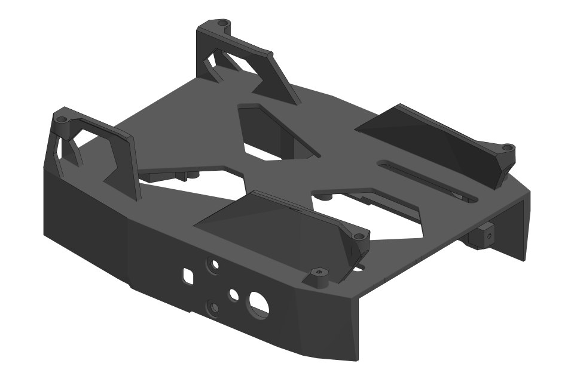

## Caster Wheel

| Qty | Part | Render |
|:---:|:-----|:------:|
| 1   | `caster_base_65mm.stl` | 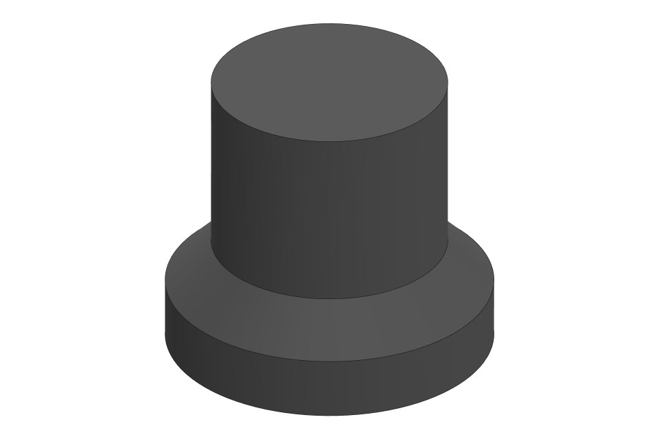 |
| 1   | `caster_shroud_65mm.stl` | 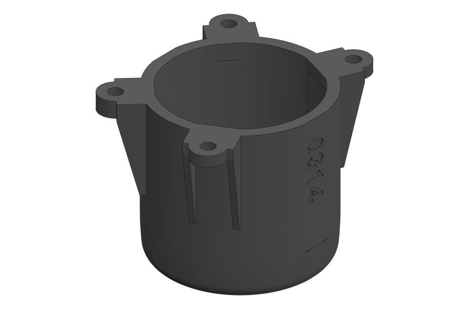 |

The caster needs a 25.4 mm (1 inch) ball, see the [components](../components.md).

## SBC Decks

There are two decks, one for each single-board computer:

=== "Raspberry Pi deck"

    | Qty | Part | Render |
    |:---:|:-----|:------:|
    | 1   | `raspberry_pi_deck.stl` | 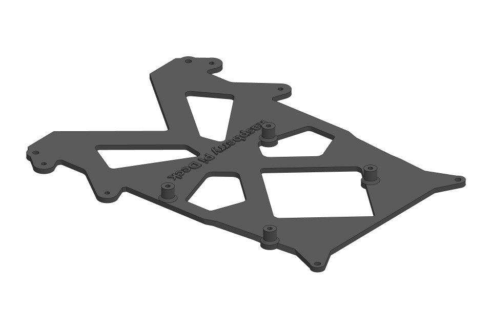 |

=== "Jetson Nano deck"

    | Qty | Part | Render |
    |:---:|:-----|:------:|
    | 1   | `jetson_nano_deck.stl` |  |

## LiDAR Platform

=== "RPLiDAR A2 M8"

    | Qty | Part | Render |
    |:---:|:-----|:------:|
    | 1   | `platfom_rplidar_a2.stl` | 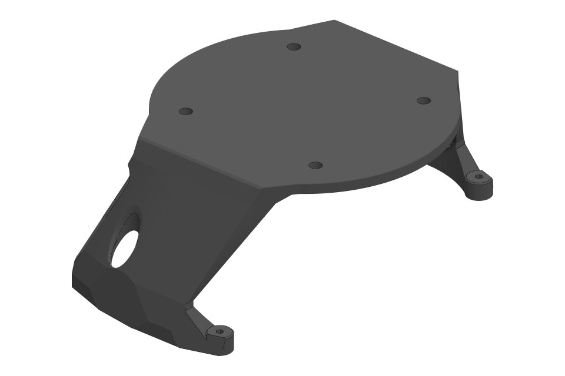 |
    | 1   | `slamtec_holder.stl` | 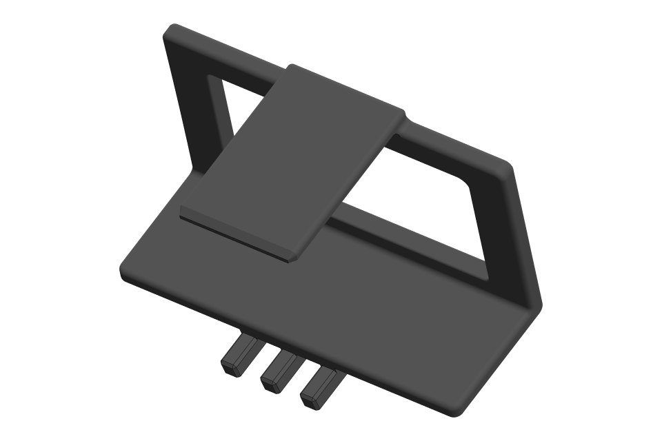 |

=== "RPLiDAR A1 M8"

    | Qty | Part | Render |
    |:---:|:-----|:------:|
    | 1   | `platform_rplidar_a1.stl` | 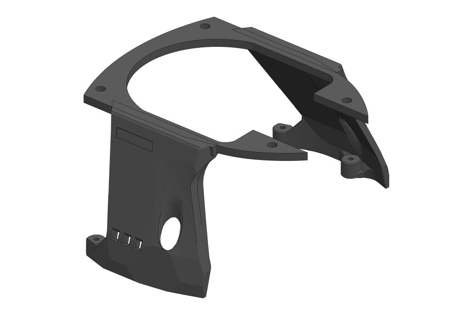 |

## Camera Mount

| Qty | Part | Render |
|:---:|:-----|:------:|
| 1   | `camera_mount.stl` | 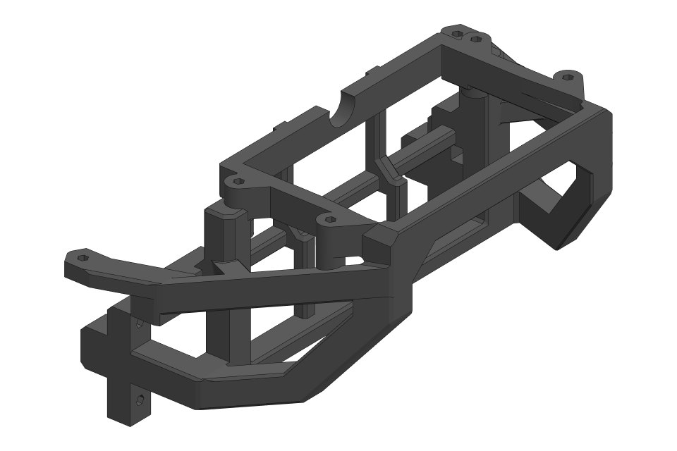 |

The camera mount takes an adapter for your camera:

=== "Raspberry Pi Camera v2"

    | Qty | Part | Render |
    |:---:|:-----|:------:|
    | 1   | `Raspberry_pi_CAM_holder.stl` | 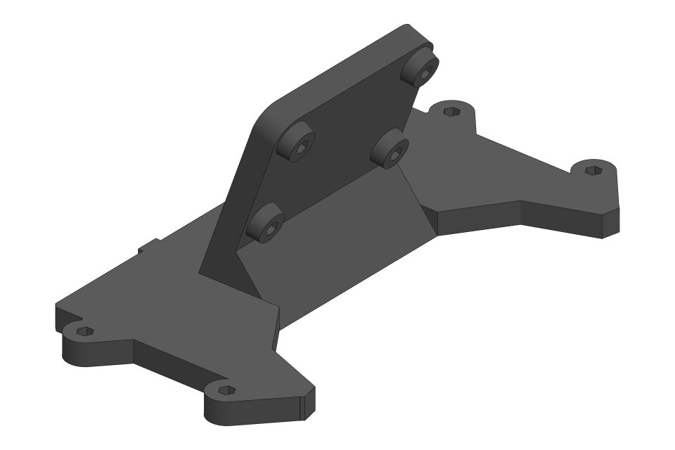 |

=== "OAK-1"

    | Qty | Part | Render |
    |:---:|:-----|:------:|
    | 1   | `OAK-1_adjustment_mount.stl` | 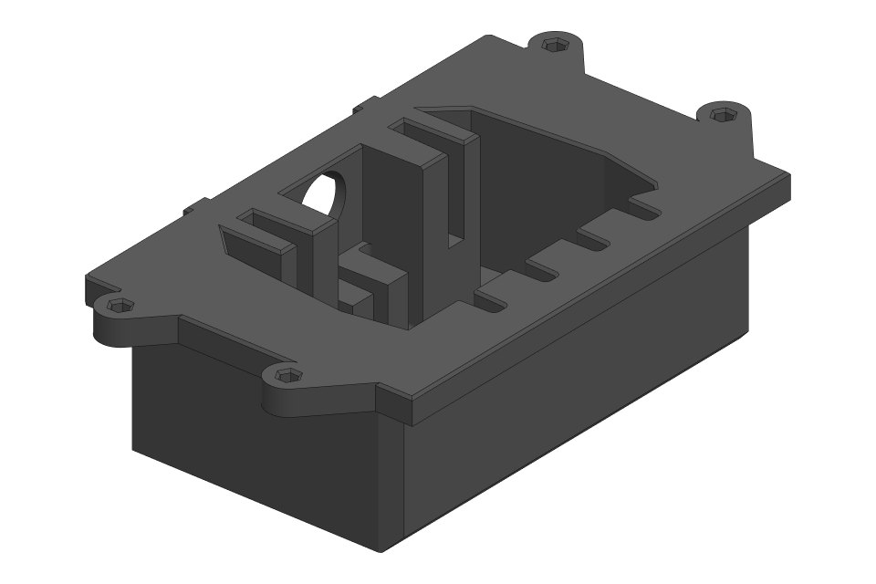 |

=== "OAK-D"

    | Qty | Part | Render |
    |:---:|:-----|:------:|
    | 1   | `OAK-D_adjustment_mount.stl` | 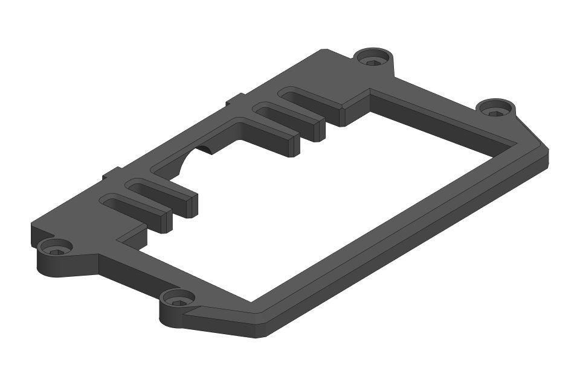 |
