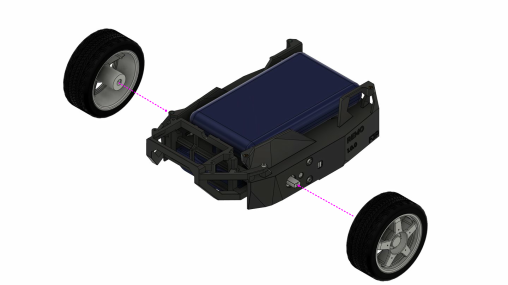

# Assembly

The following video gives an overview of the robot's components and how it will be assembled:

<iframe width="560" height="315" src="https://www.youtube.com/embed/6aAEbtfVbAk" title="YouTube video player" frameborder="0" allow="accelerometer; autoplay; clipboard-write; encrypted-media; gyroscope; picture-in-picture" allowfullscreen></iframe>

More detailed assembly instructions are found in the next few sections.
The parts are listed in the [components](../components.md) and the [3D printed parts](3D_print.md).

## Frame

The frame is assembled in 13 steps. In each drawing, the dashed magenta lines show where a part goes.
Steps 2 to 8 work on the bottom of the chassis, so turn it upside down after step 1.

### Step 1: Threaded inserts

Press the four M2 brass threaded inserts into the holes of the corner posts on top of the chassis, for example with a soldering iron.
The decks are screwed into these inserts later, so they can be swapped often without wearing out the plastic threads.

**Parts:** chassis, 4 × M2 brass threaded insert

### Step 2: First motor

Turn the chassis upside down and place the first DG01D-E motor in its pocket on one side.

**Parts:** 1 × DG01D-E hobby motor with encoder

### Step 3: Second motor

Place the second motor in the pocket on the other side.

**Parts:** 1 × DG01D-E hobby motor with encoder

### Step 4: Motor screws

Fix each motor with two M3 × 25 mm screws through the side wall of the chassis and the motor.
On the inside, put an M3 nut on each screw, in the opening of the motor.
The drawing shows the nuts for the far motor; the other motor gets the same two nuts, hidden from this angle.

**Parts:** 4 × M3 × 25 mm screw, 4 × M3 nut

### Step 5: Motor driver

Place the motor driver board between the two motors.

**Parts:** Adafruit DC Motor (+ Stepper) FeatherWing

### Step 6: Motor driver screws

Fix the board with four screws.

**Parts:** 4 × M2 self-tapping screw

### Step 7: Caster

Put the caster ball into the printed caster base and shroud, then place the caster in the round opening of the chassis.

**Parts:** caster base and shroud (printed), 1 × caster ball (25.4 mm)

### Step 8: Caster screws

Fix the caster with four screws.

**Parts:** 4 × M2 self-tapping screw

### Step 9: Battery pack

Turn the chassis right side up again and slide the battery pack into the compartment under the top plate.

**Parts:** battery pack (for four or eight batteries)

### Step 10: Camera mount

Slide the camera mount over the open side of the battery compartment.
It keeps the battery pack in place and later holds the adapter for your camera (see [Camera Mount](3D_print.md#camera-mount) on the 3D printing page).

**Parts:** camera mount (printed, `camera_mount.stl`)

### Step 11: Camera mount screws

Fix the camera mount with screws from both sides and from the top.

**Parts:** 6 × M2 self-tapping screw

### Step 12: Powerbank

Place the powerbank in its compartment on top of the chassis. It fits snugly; two adhesive pads keep it from shifting.
It can be at most 135.5 × 71 × 18 mm (L × W × H).

**Parts:** powerbank, 2 × adhesive pad

### Step 13: Wheels

Push the wheels onto the motor shafts.

**Parts:** 2 × wheel

## Bread Board

