# Assembly

The following video gives an overview of the robot's components and how it will be assembled:

<iframe width="560" height="315" src="https://www.youtube.com/embed/6aAEbtfVbAk" title="YouTube video player" frameborder="0" allow="accelerometer; autoplay; clipboard-write; encrypted-media; gyroscope; picture-in-picture" allowfullscreen></iframe>

More detailed assembly instructions are found in the next few sections.
The parts are listed in the [components](../components.md) and the [3D printed parts](3D_print.md).

## Frame

The frame is assembled in 14 steps. In each drawing, the dashed magenta lines show where a part goes.
Steps 2 to 9 work on the bottom of the chassis, so turn it upside down after step 1.

### Step 1: Threaded inserts

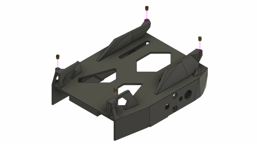

Press the four M2 brass threaded inserts into the holes of the corner posts on top of the chassis, for example with a soldering iron.
The decks are screwed into these inserts later, so they can be swapped often without wearing out the plastic threads.

**Parts:** chassis, 4 × M2 brass threaded insert

### Step 2: First motor

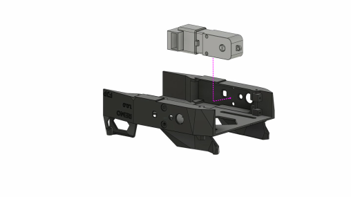

Turn the chassis upside down and place the first DG01D-E motor in its pocket on one side.

**Parts:** 1 × DG01D-E hobby motor with encoder

### Step 3: Second motor

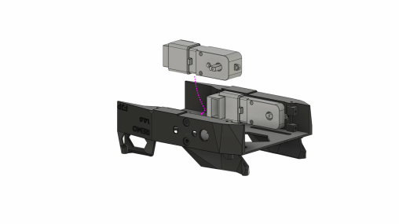

Place the second motor in the pocket on the other side.

**Parts:** 1 × DG01D-E hobby motor with encoder

### Step 4: Motor screws

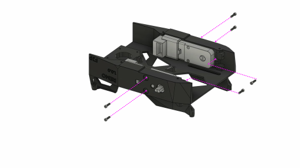

Fix each motor with two M3 × 25 mm screws through the side wall of the chassis and the motor.
On the inside, put an M3 nut on each screw, in the opening of the motor.
The drawing shows the nuts for the far motor; the other motor gets the same two nuts, hidden from this angle.

**Parts:** 4 × M3 × 25 mm screw, 4 × M3 nut

### Step 5: Motor driver

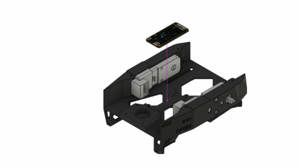

Place the motor driver board between the two motors.

Some boards come with the screw terminals and pin headers loose, others with everything soldered on.
If yours are loose, solder them on before this step. The drawings show the board without them.
The cables are connected in step 7, once the board is screwed in.

**Parts:** Adafruit DC Motor (+ Stepper) FeatherWing

### Step 6: Motor driver screws

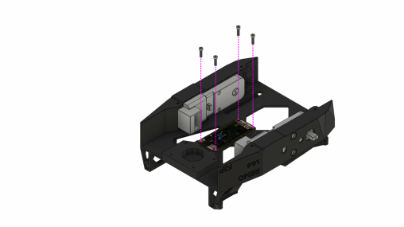

Fix the board with four screws.

**Parts:** 4 × M2 self-tapping screw

### Step 7: Motor cables

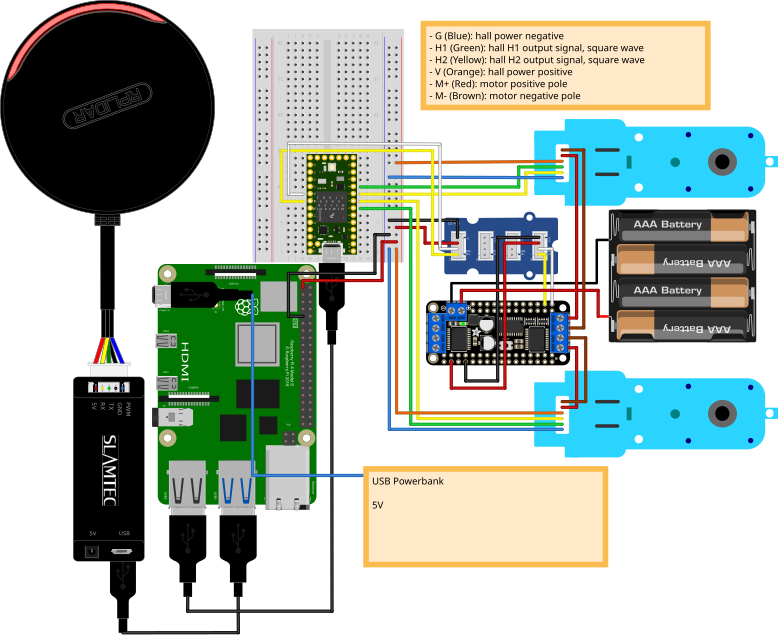

Connect the motors to the motor driver as shown in the Fritzing view above (also on the [Electronics](electronics.md) page):

- Screw the red (M+) and brown (M−) wire of each motor cable into the `M3`/`M4` terminal block of the board.
  The firmware expects the left motor on `M4` and the right motor on `M3` (`MOTOR_LEFT` and `MOTOR_RIGHT` in `diffbot_base_config.h`, see [low-level base controller](../packages/diffbot_base/low-level.md)).
  If a wheel turns the wrong way later, swap its red and brown wire.
- The other four wires of each motor cable (blue G, green H1, yellow H2, orange V) belong to the encoder.
  They go to the Teensy on the breadboard, not to the motor driver.
  Keep each encoder with its motor: H1 and H2 of the left motor go to Teensy pins 5 and 6, those of the right motor to pins 7 and 8.

!!! warning "The Fritzing view pairs the motors the other way round"
    In the Fritzing view, the motor on `M3` has its encoder on pins 5 and 6.
    The firmware reads pins 5 and 6 for the motor on `M4`.
    Follow the text above until the diagram is fixed.

The battery cable follows in step 10. The Fritzing view also shows the I2C wires from the board to the Grove I2C hub.

**Parts:** 2 × motor cable (comes with the motors)

### Step 8: Caster

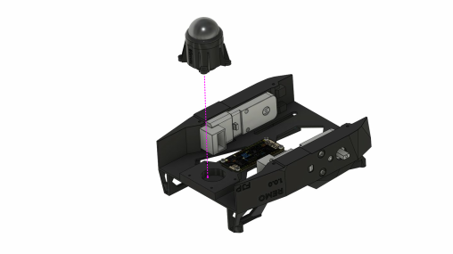

Put the caster ball into the printed caster base and shroud, then place the caster in the round opening of the chassis.

**Parts:** caster base and shroud (printed), 1 × caster ball (25.4 mm)

### Step 9: Caster screws

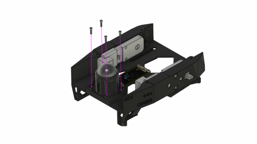

Fix the caster with four screws.

**Parts:** 4 × M2 self-tapping screw

### Step 10: Battery pack

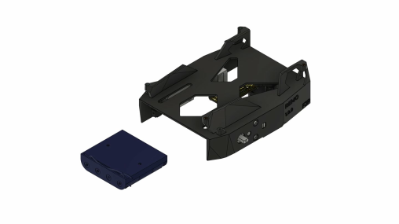

While the chassis is still upside down, connect the cable of the empty battery pack to the 2-pin power terminal of the motor driver: black to − and red to +, as marked on the board.
Then turn the chassis right side up again and slide the battery pack into the compartment under the top plate.
Leave the batteries out until all the wiring is done.

**Parts:** battery pack (for four or eight batteries)

### Step 11: Camera mount

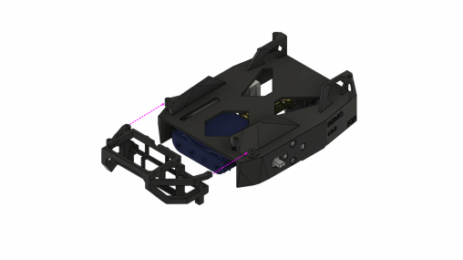

Slide the camera mount over the open side of the battery compartment.
It keeps the battery pack in place and later holds the adapter for your camera (see [Camera Mount](3D_print.md#camera-mount) on the 3D printing page).

**Parts:** camera mount (printed, `camera_mount.stl`)

### Step 12: Camera mount screws

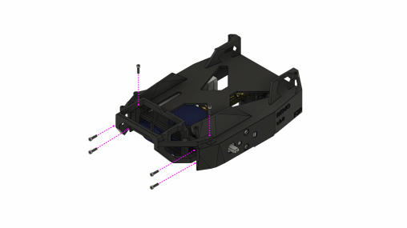

Fix the camera mount with screws from both sides and from the top.

**Parts:** 6 × M2 self-tapping screw

### Step 13: Powerbank

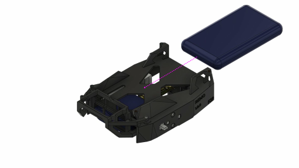

Place the powerbank in its compartment on top of the chassis. It fits snugly; two adhesive pads keep it from shifting.
It can be at most 135.5 × 71 × 18 mm (L × W × H).

**Parts:** powerbank, 2 × adhesive pad

### Step 14: Wheels

Push the wheels onto the motor shafts.

**Parts:** 2 × wheel

## Decks and sensors

Steps 15 to 22 add the electronics, the LiDAR and the camera on top of the frame.
The drawings from step 16 on are rendered from the STL files; again, the dashed magenta lines show where a part goes.

### Step 15: Breadboard parts

Push the Teensy 4.0 into the breadboard. The drawing also shows the BNO055 IMU, which is optional.
The wiring follows the Fritzing view on the [Electronics](electronics.md) page.

**Parts:** 400-point breadboard, Teensy 4.0, BNO055 IMU (optional)

### Step 16: Raspberry Pi deck

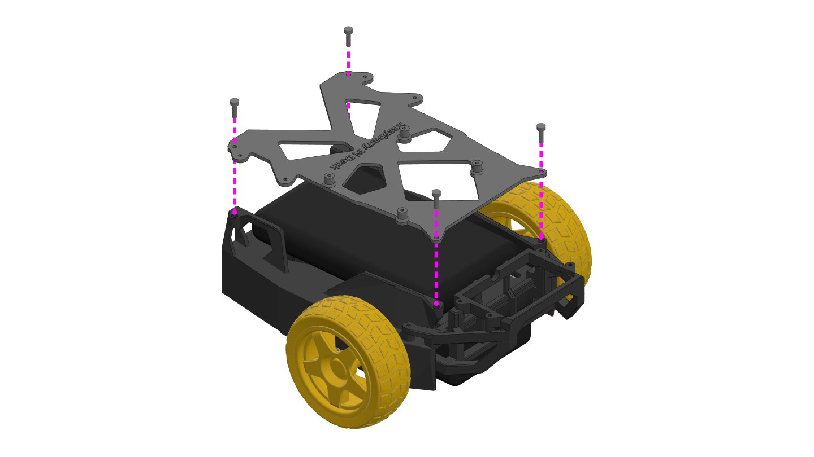

Place the Raspberry Pi deck on top of the chassis, over the powerbank.
Fix it with four M2 × 8 mm screws into the threaded inserts from step 1.
With a Jetson Nano, use the Jetson Nano deck instead. It goes on the same way; only its mounting holes for the board differ.

**Parts:** Raspberry Pi deck (printed, `raspberry_pi_deck.stl`), 4 × M2 × 8 mm screw

### Step 17: Raspberry Pi

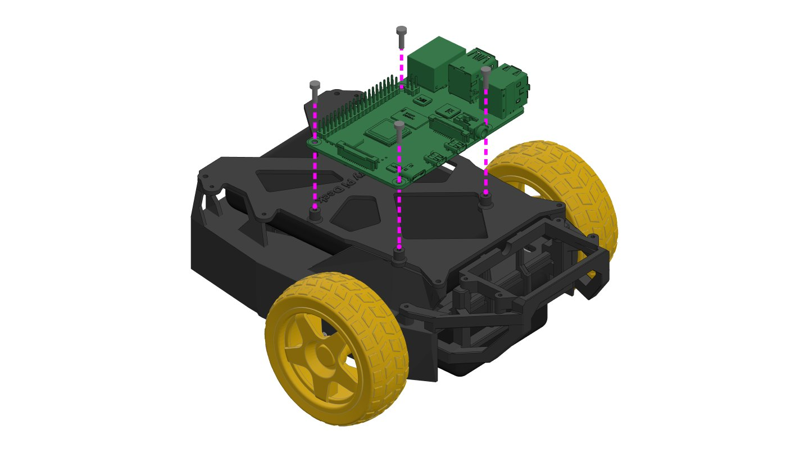

Press four M2 brass threaded inserts into the bosses of the deck, as in step 1.
Then screw the Raspberry Pi 4 onto them with four M2 × 8 mm screws, with its USB and Ethernet ports toward the left wheel.

**Parts:** Raspberry Pi 4 B, 4 × M2 brass threaded insert, 4 × M2 × 8 mm screw

### Step 18: Breadboard

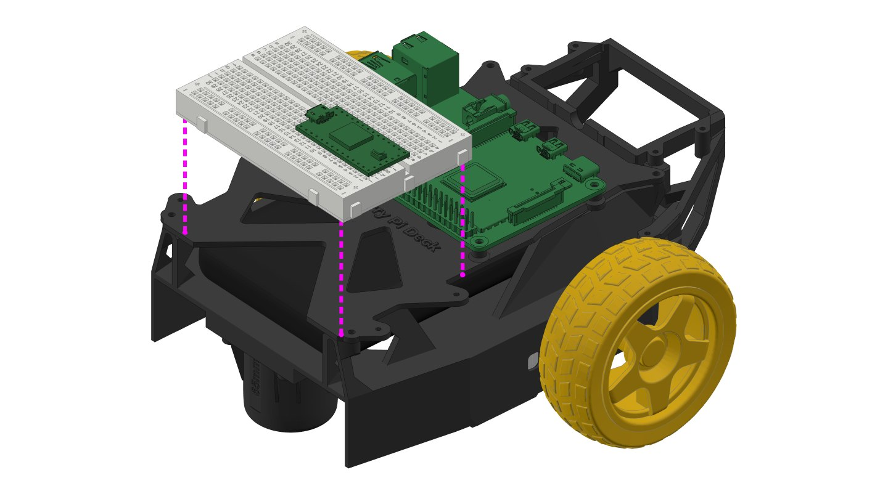

Place the breadboard from step 15 on the back of the deck, behind the Raspberry Pi.
Fix it with a Velcro strap, or with the adhesive tape on the bottom of the breadboard.

**Parts:** breadboard from step 15, Velcro strap (or the breadboard's adhesive tape)

### Step 19: LiDAR platform

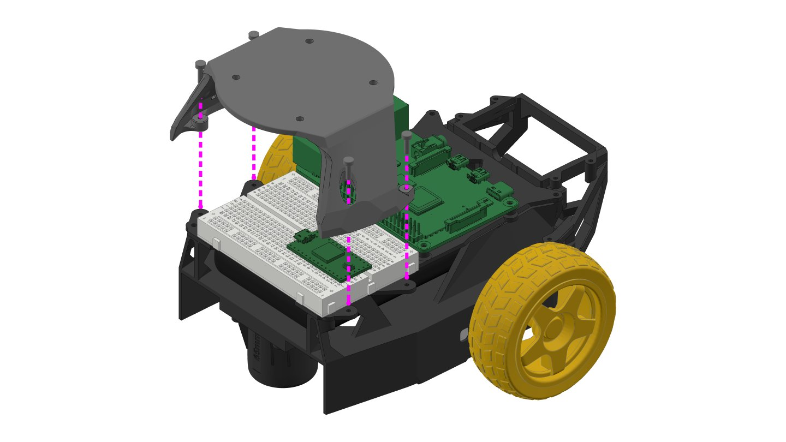

Place the LiDAR platform over the breadboard and fix its four feet to the deck.

**Parts:** LiDAR platform (printed, `platfom_rplidar_a2.stl`), 4 × M2 self-tapping screw

### Step 20: LiDAR

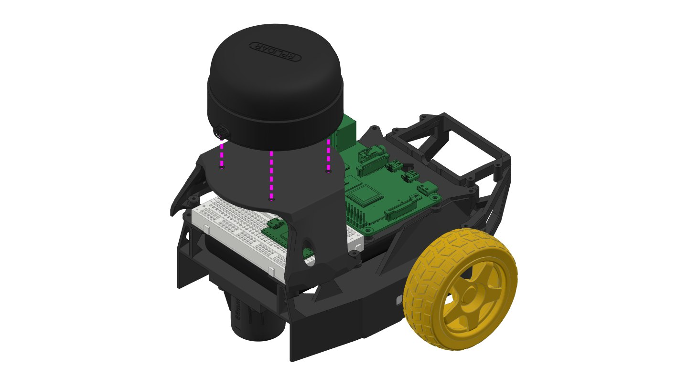

Put the RPLiDAR A2 on the platform and screw it on from below with four M3 screws, through the four holes in the platform.

**Parts:** SLAMTEC RPLiDAR A2 M8, 4 × M3 × 6 mm screw

### Step 21: USB adapter holder

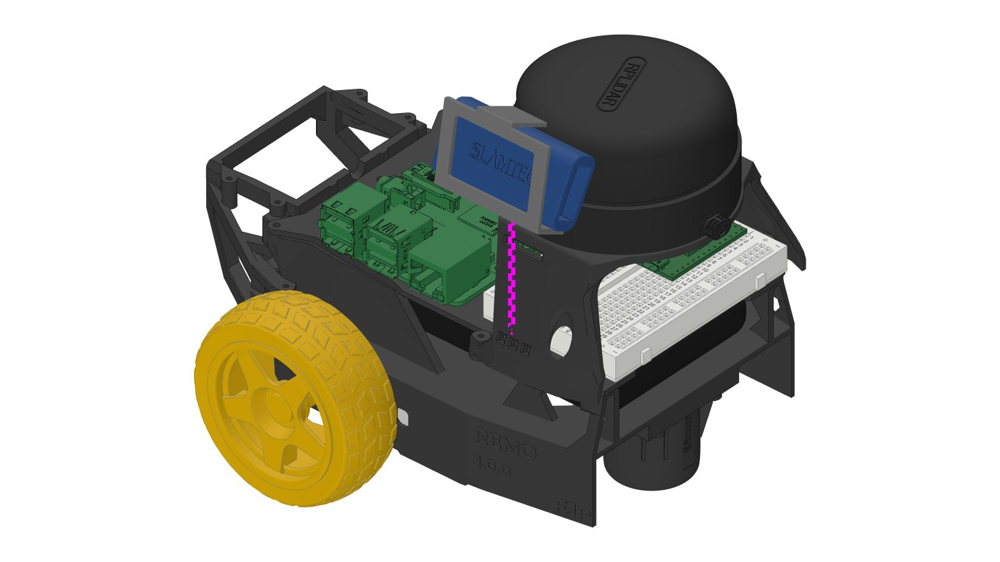

Put the SLAMTEC USB adapter into the printed holder, then clip the holder onto the left side of the LiDAR platform.

**Parts:** SLAMTEC holder (printed, `slamtec_holder.stl`), SLAMTEC USB adapter (comes with the LiDAR)

### Step 22: Camera

Each camera has its own printed adapter.
Screw the adapter onto the camera mount from step 11 with four M2 self-tapping screws.
Then set the camera into the adapter, where its weight holds it, or fix it with four more M2 self-tapping screws (optional).

=== "Raspberry Pi Camera v2"

    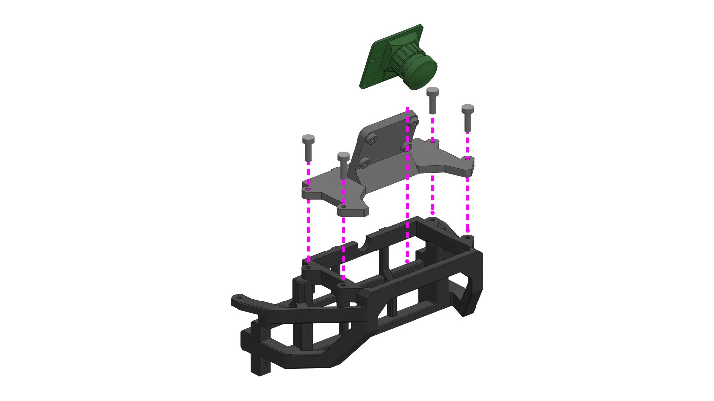

    **Parts:** Raspberry Pi Camera holder (printed, `Raspberry_pi_CAM_holder.stl`), Raspberry Pi Camera v2, 4 × M2 self-tapping screw (4 more to screw the camera in, optional)

=== "OAK-1"

    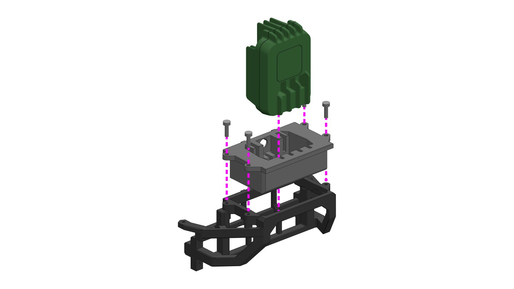

    **Parts:** OAK-1 adjustment mount (printed, `OAK-1_adjustment_mount.stl`), OAK-1, 4 × M2 self-tapping screw (4 more to screw the camera in, optional)

=== "OAK-D"

    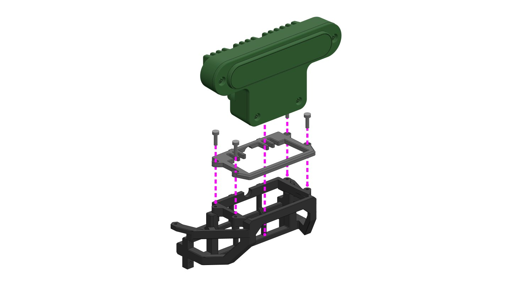

    The OAK-D covers the adapter's screw holes, so screw the adapter on before you attach the camera.

    **Parts:** OAK-D adjustment mount (printed, `OAK-D_adjustment_mount.stl`), OAK-D, 4 × M2 self-tapping screw (4 more to screw the camera in, optional)

