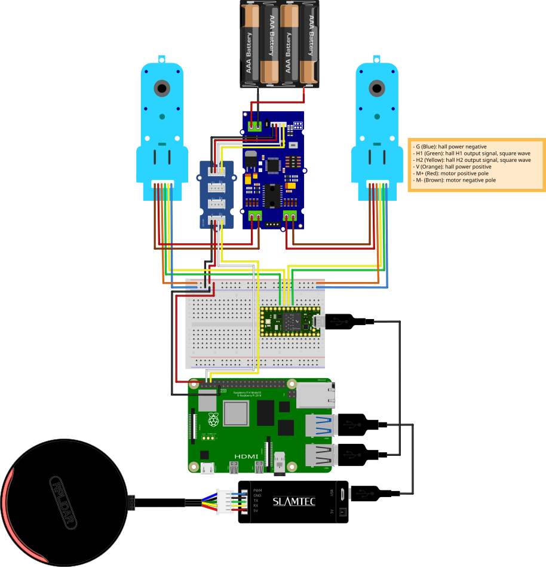

## Why a Microcontroller?

A [microcontroller](https://en.wikipedia.org/wiki/Microcontroller) (MCU) is a small computer on a single chip, with its own processor, memory and input and output pins. It runs one program, usually without an operating system, so it can react to a signal within microseconds.

The robot's single board computer, a Raspberry Pi, runs Linux and ROS: mapping, navigation and the connection to your PC. But Linux isn't a [real-time operating system](https://en.wikipedia.org/wiki/Real-time_operating_system): many processes share the processor, and Linux doesn't guarantee when a program gets its turn. Driving the motors needs exactly that:

- **Counting encoder pulses:** every pulse from the wheel encoders has to be counted, also while Linux is busy with other work. A missed pulse means a wrong distance.
- **Speed control:** the PID controllers that keep the wheels at the commanded speed have to run at a steady rate (see the [low-level PID approach](../packages/diffbot_base/low-level.md)).

So the microcontroller does this time-critical work: it counts the encoder pulses, runs the speed control and drives the motors through the motor driver. Over USB, it reports the encoder counts to the Raspberry Pi and receives the commanded wheel speeds.

## Which Microcontroller?

The firmware in [`diffbot_base/scripts/base_controller`]({{ diffbot_repo_url }}/diffbot_base/scripts/base_controller) runs on a [Teensy](https://www.pjrc.com/teensy/), a small board by PJRC with a 32-bit ARM processor. It's programmed like an Arduino, with the [Teensyduino](https://www.pjrc.com/teensy/teensyduino.html) add-on or PlatformIO, so most Arduino code works on it. Two things make it a good fit here:

- **Interrupts on every digital pin:** the firmware counts the encoders with PJRC's [Encoder library](https://www.pjrc.com/teensy/td_libs_Encoder.html), which works best when both signals of an encoder are on interrupt pins. On the Teensy, all digital pins are; an Arduino Uno has only two, pins 2 and 3.
- **Speed and memory to spare:** a faster processor and much more RAM than the classic Arduinos, which leaves room for rosserial (see [below](#other-boards-such-as-an-arduino)).

The firmware has two PlatformIO environments, and CI builds both:

| Board | Robot | PlatformIO environment |
|:------|:------|:-----------------------|
| [Teensy 4.0](https://www.pjrc.com/store/teensy40.html) | Remo | `teensy40` (default) |
| [Teensy 3.2](https://www.pjrc.com/store/teensy32.html) | DiffBot | `teensy31` |

### Other boards, such as an Arduino

Only the two Teensy boards above are tested. Using another board, such as an Arduino Uno or Mega, means porting the firmware (pins, libraries, the PlatformIO environment) and then checking its memory use and timing on that board.

The firmware talks to ROS with [rosserial](http://wiki.ros.org/rosserial): the board runs its own ROS node, which keeps message buffers and its publisher and subscriber tables in RAM. On the Teensy and the Mega 2560, rosserial uses 512-byte buffers in each direction and up to 25 publishers and subscribers; on the Uno (ATmega328P) it uses smaller 280-byte buffers. rosserial itself supports these boards, but the classic Arduinos leave much less room for the rest of the firmware:

| Board | Processor | Clock | RAM |
|:------|:----------|------:|----:|
| Arduino Uno | ATmega328P | 16 MHz | 2 KB |
| Arduino Mega 2560 | ATmega2560 | 16 MHz | 8 KB |
| Teensy 3.2 | MK20DX256 | 72 MHz | 64 KB |
| Teensy 4.0 | i.MX RT1062 | 600 MHz | 1024 KB |

[Discussion #94](https://github.com/ros-mobile-robots/diffbot/discussions/94) is one attempt. A port to an Arduino Mega 2560 kept failing with "Unable to sync with device", "Mismatched protocol version" and checksum errors. Tight memory was one suspected cause, alongside message rates, baud rate and the ported code, but the cause wasn't confirmed. Ports to STM32 boards with 64 KB and 128 KB RAM then connected, but still had sync and checksum errors, and the builder ordered a Teensy.

### Without rosserial: a simple serial protocol

A different design avoids running ROS on the board at all. In [ros_arduino_bridge](https://github.com/hbrobotics/ros_arduino_bridge), a ROS 1 project, the Arduino firmware only understands a few short text commands over the serial port ([`commands.h`](https://github.com/hbrobotics/ros_arduino_bridge/blob/indigo-devel/ros_arduino_firmware/src/libraries/ROSArduinoBridge/commands.h)), and a Python node on the computer translates between them and ROS topics. For example:

| Command | Meaning |
|:--------|:--------|
| `e` | Read both encoder counts |
| `r` | Reset the encoder counts |
| `m <left> <right>` | Set the wheel speeds, in encoder ticks per second; the firmware's PID controllers keep them |
| `u <kp>:<kd>:<ki>:<ko>` | Set the PID gains; `ko` divides the PID output to scale it |

For safety, the motors stop by default when no new speed command arrives for two seconds. Because the board only parses short commands and keeps no ROS message buffers, a small Arduino is enough.

The same protocol also works with ROS 2: [diffdrive_arduino](https://github.com/joshnewans/diffdrive_arduino) is a ros2_control hardware interface for this firmware, and its author's [fork of ros_arduino_bridge](https://github.com/joshnewans/ros_arduino_bridge) adds a command for raw PWM values (`o <left> <right>`). It's an option for DiffBot's ROS 2 firmware, which is on the [roadmap](https://github.com/orgs/ros-mobile-robots/projects/3).

## Teensy Setup

The Teensy 3.2 microcontroller (MCU) is used to get the ticks from the encoders attached to the motors and send this information (counts) as a message over the `/diffbot/ticks_left`
and `/diffbot/ticks_right` topics. For this rosserial is running on the Teensy MCU which allows it to create a node on the Teensy that can communicate with
the ROS Master running on the Raspberry Pi.

To setup rosserial on the work PC and the Raspberry Pi the following package has to be installed:

```console
sudo apt install ros-noetic-rosserial
```

To program the Teensy board with the work PC the Arduino IDE with the Teensyduino add-on can be used. Other options are to use PlatformIO plugin for VSCode.
How to install the Arduino IDE and Teensyduino is listed in the [instructions on the Teensy website](https://www.pjrc.com/teensy/td_download.html).
Here the instructions to setup Teensyduino in Linux are listed:

> 1. Download the Linux udev rules (link at the top of this page) and copy the file to /etc/udev/rules.d.
>    `sudo cp 49-teensy.rules /etc/udev/rules.d/`
> 2. Download and extract one of Arduino's Linux packages.
>    Note: Arduino from Linux distro packages is not supported.
> 3. Download the corresponding Teensyduino installer.
> 4. Run the installer by adding execute permission and then execute it.
>    `chmod 755 TeensyduinoInstall.linux64`
>     `./TeensyduinoInstall.linux64`

The first step can be used on the work PC and the Raspberry Pi to enable the USB communication with the Teensy board.
Step two of these instructions are only necessary on the work PC to actually program the Teensy board.

!!! note
    Make sure to download the Arduino IDE from the website and don't install it from the Ubuntu repositories.


The following video shows installation process, 
more instructions to setup the Arduino IDE can be found in the [ROS wiki](http://wiki.ros.org/rosserial_arduino/Tutorials/Arduino%20IDE%20Setup).


<iframe width="560" height="315" data-consent-src="https://www.youtube-nocookie.com/embed/k56e-KBiP-w" frameborder="0" allow="accelerometer; autoplay; clipboard-write; encrypted-media; gyroscope; picture-in-picture" allowfullscreen></iframe>


To check if the connection to the Teensy board works use these commands on the Raspberry Pi:

```console
$ lsusb
Bus 002 Device 001: ID 1d6b:0003 Linux Foundation 3.0 root hub
Bus 001 Device 003: ID 16c0:0483 Van Ooijen Technische Informatica Teensyduino Serial
Bus 001 Device 002: ID 2109:3431 VIA Labs, Inc. Hub
Bus 001 Device 001: ID 1d6b:0002 Linux Foundation 2.0 root hub
```

And to see on which serial port it is connected use:

```console
$ ls /dev | grep ttyACM0
ttyACM0
```

If the output is empty it might be the case that the board is connected to another port like `ttyUSB0`.  

## Encoder Program

When installing Teensyduino new example programs are provided. One of them is to test Encoders. 
The code for the motor encoders uses it as basis together with a pubsub example from rosserial:

The program is [`encoders.ino`](https://github.com/ros-mobile-robots/diffbot/blob/noetic-devel/diffbot_base/scripts/encoders/encoders/encoders.ino) in the diffbot repository.


After the program is flashed to the Teensy board it can be tested with the following procedure:

1. Start a ROS [master](http://wiki.ros.org/Master) by executing [`roscore`](http://wiki.ros.org/roscore) in a new terminal.
2. Create a rosserial node using `rosserial_python` package:

```console
$ rosrun rosserial_python serial_node.py _port:=/dev/ttyACM0 _baud:=115200
[INFO] [1602784903.659869]: ROS Serial Python Node
[INFO] [1602784903.692366]: Connecting to /dev/ttyACM0 at 115200 baud
[INFO] [1602784905.809722]: Requesting topics...
[INFO] [1602784905.824418]: Note: publish buffer size is 512 bytes
[INFO] [1602784905.829712]: Setup publisher on /diffbot/ticks_left [std_msgs/Int32]
[INFO] [1602784905.839914]: Setup publisher on /diffbot/ticks_right [std_msgs/Int32]
[INFO] [1602784905.856772]: Note: subscribe buffer size is 512 bytes
[INFO] [1602784905.861749]: Setup subscriber on /reset [std_msgs/Empty]
```

In case of the following error, probably the wrong program is flashed to the Teensy board:

```console
[ERROR] [1602782376.724880]: Unable to sync with device; possible link problem or link software version mismatch such as hydro rosserial_python with groovy Arduino
```

!!! note
    Note that the rosserial node needs to be stopped to flash new sketches to the Teensy board.

Each [DG01D-E](https://www.sparkfun.com/products/16413) motor has two signal pins for its built-in encoder. For these, the Teensy pins 5, 6 are used for the left encoder and 7, 8 are used for the right one, see also the [Teensy pinout](https://www.pjrc.com/teensy/pinout.html).


<figure>
    <a href="{{ asset_dir }}/hardware/teensy40-pinout01.png"></a>
    <figcaption>Teensy 4.0 Pins.</figcaption>
</figure>


The bread board view of [Fritzing](https://fritzing.org/) shows the connection schematic and is shown for both models in the following:

=== "DiffBot"

    

=== "Remo"

    
        


With one motor encoder connected to pins 5, 6, echo the `/encoder_ticks` topic:

```console
rostopic echo /encoder_ticks
```

Rotating a wheel attached to the motor shaft 360 degree (one full turn) will increase the first value of the encoders array:

```console
---
header: 
  seq: 190323
  stamp: 
    secs: 0
    nsecs:         0
  frame_id: ''
encoders: [0, 0]
---
header: 
  seq: 190324
  stamp: 
    secs: 0
    nsecs:         0
  frame_id: ''
encoders: [230, 0]
---
header: 
  seq: 190325
  stamp: 
    secs: 0
    nsecs:         0
  frame_id: ''
encoders: [350, 0]
---
header: 
  seq: 190326
  stamp: 
    secs: 0
    nsecs:         0
  frame_id: ''
encoders: [480, 0]
---
header: 
  seq: 190327
  stamp: 
    secs: 0
    nsecs:         0
  frame_id: ''
encoders: [540, 0]

```

The found value 540 for a full turn of the wheel is important for the hardware interface.


## Base Controller

If you are working with Remo the recommende way is to use `base_controller` from `diffbot_base/scripts` instead of the `encoders.ino`.
Build instructions using Visual Studio Code including the PlatformIO plugin are shown in the following video:

<iframe width="560" height="315" data-consent-src="https://www.youtube-nocookie.com/embed/Mn6DY1tNUcU" title="YouTube video player" frameborder="0" allow="accelerometer; autoplay; clipboard-write; encrypted-media; gyroscope; picture-in-picture" allowfullscreen></iframe>

When using `base_controller` you should use the low level PID controllers running on the MCU.
