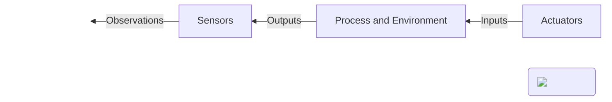

## Introduction to Control Systems

!!! quote
    Control systems is the science of making machines behave the way we want them to behave as opposed to how they would naturally behave.

Systems have input and output signals and a behavior that evolves over time.
Systems can be broken down into components, which are something that we think we understand.
In physical systems, inputs are generated by actuators. For example, DC motors or LEDs. 
Outputs are measured by sensors, for example, cameras or wheel encoders.
These sensors produce observations.

In the case of a mobile robot, the system is the real physical robot and its environment around it.
This system receives inputs from the robot's actuators, which results in an observable output by the
robot's sensors. For example a change in the camera viewport of the environment or a change in encoder ticks because of rotating wheels.

Controlling a system means to design a logical component that
will output, at every instant in time, the commands for the plant
actuators so that the output of our system follow a given plan.