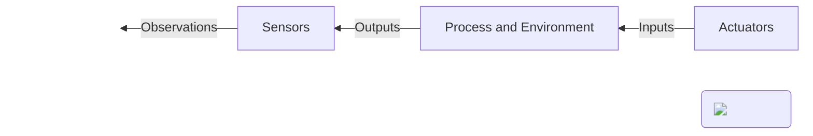

# Introduction to Control Systems

!!! quote
    Control systems is the science of making machines behave the way we want them to behave as opposed to how they would naturally behave.

Systems have input and output signals and a behavior that evolves over time.
Systems can be broken down into components, which are something that we think we understand.
In physical systems, inputs are generated by actuators. For example, DC motors or LEDs.
Outputs are measured by sensors, for example, cameras or wheel encoders.
These sensors produce observations.




In the case of a mobile robot, the system is the real physical robot and its environment around it.
This system receives inputs from the robot's actuators, which results in an observable output by the
robot's sensors. For example a change in the camera viewport of the environment or a change in encoder ticks because of rotating wheels.

Controlling a system means to design a logical component that
will output, at every instant in time, the commands for the plant
actuators so that the output of our system follow a given plan.

## Need for Control Systems

The main objectives of the controller are the following:

1. Stability
2. Performance
3. Robustness

### Stability

Mathematically, stability can be formalized as [Bounded Input Bounded Output](https://en.wikipedia.org/wiki/BIBO_stability). 
The output of a system will be bounded for every input to the system that is bounded. 

!!! todo "TODO"
    Add stability image

In other words, if finite energy is provided to the system, then finite energy should exit the system.


!!! todo "TODO"
    Add stability I/O image

According to the definition of stability provided (BIBO stability), 
a system goes unstable when an output of the system diverges (always continues growing in time), 
when provided with a finite energy input. When defining the output as "distance from the center of the lane", 
driving outside of the road would be an example of instability.

<div class="row">
  <div class="column">
    <script type="text/tikz">
  \begin{tikzpicture}
    % Draw axes
    \draw[help lines, color=gray!30, dashed] (-0.1,-0.1) grid (3.0,2.0);
    \draw [<->,thick] (0,2) node (a) [above] {$y$}
        |- (3,0) node (b) [right] {$x$};
    % Draw two intersecting lines
    \draw[color=red] (0,0) -- (0,1.5) coordinate (b_1) -- (2.5,1.5) coordinate (b_2);
  \end{tikzpicture}
    </script>
  </div>
  <div class="column">
      <script type="text/tikz">    
\begin{tikzpicture}[node distance=2.5cm,auto]
    \node [draw, fill=blue!20, minimum size=2em, pin={[pin edge={to-,thin,black}]above:$v_0$}] (a) {$\frac{1}{s}$};
    \node (b) [left of=a,node distance=2cm, coordinate] {a};
    \node [draw, fill=blue!20, minimum size=2em, pin={[pin edge={to-,thin,black}]above:$p_0$}] (c) [right of=a] {$\frac{1}{s}$};
    \node [coordinate] (end) [right of=c, node distance=2cm]{};
    \path[->] (b) edge node {$a$} (a);
    \path[->] (a) edge node {$v$} (c);
    \draw[->] (c) edge node {$p$} (end);
\end{tikzpicture}
    </script>
  </div>
  <div class="column">
      <script type="text/tikz">
  \begin{tikzpicture}
    % Draw axes
    \draw[help lines, color=gray!30, dashed] (-0.1,-0.1) grid (3.0,2.0);
    \draw [<->,thick] (0,2) node (a) [above] {$y$}
        |- (3,0) node (b) [right] {$x$};
    % Draw two intersecting lines
    \draw[color=red] (0,0) -- (0,1.5) coordinate (b_1) -- (2.5,1.5) coordinate (b_2);
  \end{tikzpicture}
    </script>
  </div>
</div>

<script type="text/tikz">    
\begin{tikzpicture}[node distance=2.5cm,auto]
    \node [draw, fill=blue!20, minimum size=2em, pin={[pin edge={to-,thin,black}]above:$v_0$}] (a) {$\frac{1}{s}$};
    \node (b) [left of=a,node distance=2cm, coordinate] {a};
    \node [draw, fill=blue!20, minimum size=2em, pin={[pin edge={to-,thin,black}]above:$p_0$}] (c) [right of=a] {$\frac{1}{s}$};
    \node [coordinate] (end) [right of=c, node distance=2cm]{};
    \path[->] (b) edge node {$a$} (a);
    \path[->] (a) edge node {$v$} (c);
    \draw[->] (c) edge node {$p$} (end);
\end{tikzpicture}
</script>


### Performance

Beside being stable a system needs also to perform well. Performance can be measured in several ways:

- Time before reaching the target state: How quickly does the system converge to the plan
- Tracking error: how closely a reference signal is followed or how precisely does the system converge.
- Maximum acceptable error at any point in time
- Disturbance rejection: the ability to compensate for external stimuli. 
  How well can the system recover from unexpected external stimuli, such as the noise in the measurements
  or disturbances, like a sudden gust of wind or hitting a bump on the road.
- Noise attenuation: the ability to minimize the effect of high-frequency signals added to the measurements or inputs.

These are all good examples of performance criteria for controller design.

!!! todo "TODO"
    Add performance image with direct path to target and max acceptable error

### Robustness

Robustness, is the ability of the controller to provide stability and performance even in the presence of uncertainty in the mathematical model of the plant.

!!! todo "TODO"
    Add model uncertainty image

Model uncertainty can mean that the wheels of the robot are slightly of different sizes or the disposition of mass is different than what's assumed.
Also the parameters parameters of the system might just change over time because of wear and tear.
A robust controller would handle these cases well despite the uncertainty.
Robustness and performance are trade offs and striking the right balance is a challenge that really depends on the application.

Model uncertainty is defined as a "bounded variation" of the parameters describing the controlled system's model. 
Choosing completely different sensors (e.g., a camera instead of the planned pressure sensor for altitude control of a hot air balloon) 
might induce a completely different structure in the plant's model, which wouldn't not therefore be a "bounded" variation.

"Bounded variation" in the system behavior of a mobile robot could count as:

- Wear and tear of components over time.
- Slight imperfections in the assembly.

### Controller Structure

!!! todo "TODO"
    Add stability, performance, robustness images

With the mentioned objectives in mind, stability, performance, and robustness, it is important to think about the structure of the controller.

- Open Loop Control
- Close Loop Control


The simplest approach is for the user to send a predetermined sequence of commands directly to the actuators, which is called open loop control.

!!! todo "TODO"
    Add open loop image

!!! note "Open Loop Pros"
    - it is stable
    - it is convenient
    - works when the model of the system is good

!!! note "Open Loop Cons"
    - everything must be planned in advance

If our understanding of the platform response is good, we will obtain the desired outcome.
If it is not good or if something unexpected happens during the execution, then the end result will diverge from the plan.
In open loop control, information flows only in one direction, from the controller to the plant.


To enable the controller to take into account the actual execution, 
it is possible to close the loop by feeding the sensor measurements back to the controller, creating a feedback loop.

!!! todo "TODO"
    Add closed loop image

!!! note "Closed Feedback Loop Pros"
    - it adapts to circumstances

!!! note "Closed Feedback Loop Cons"
    - it is less convenient
    - it can destabalize a stable system

Feedback control is very powerful because it allows the whole system to adapt to circumstances as they are unfolding and apply corrections on the fly.
The measurements themselves, though, generally need to be processed before being fed back to the controller.
This is required because the raw measurements might include a lot of redundant data straight out of the sensors.


How to structure this agent is up to the designer, to us.

!!! todo "TODO"
    Add closed loop empty agent image

We could use different approaches, for example, a deep neural network
trained from real data or a simulation to translate the images from the camera
directly into commands to the wheels to keep the robot following a desired plan.

Traditionally, agents are designed with three main components, perception,
planning, and control: to see, to plan, and to act.

!!! todo "TODO"
    Add closed loop designed agent image


#### Perception

!!! info "Perception"

    ``` mermaid
    graph LR
      id1[""] -- observations --> P[perception]
      subgraph agent/controller
      P --> |estimate/belief|PL[planner] --> C[controller]
      P --> |estimate/belief|C
      end
      C -- commands --> id2[""]
      style id1 fill:#ffff,stroke-width:0px
      style id2 fill:#ffff,stroke-width:0px
    ```

!!! todo "TODO"
    Add closed loop empty agent image: perception highlighted

The perception block is responsible for transforming the data from the sensors into actionable information for the robot.
This passage is sometimes called filtering or estimation.
These estimates of relevant quantities, for example, the position or the orientation of the robot's reference frame with respect
to the world and the other objects in it, represent what is the robot's belief of his current state.
This belief might be more or less corresponding to the truth depending on the quality of the measurements and the perception solution used.

#### Planner

!!! todo "TODO"
    Add closed loop empty agent image: planner highlighted

The planner instead provides a reference path for the robot to follow.
For example, between two navigation points in a more general task of reaching a goal position while avoiding obstacles on the road.
The planner receives the state estimate as input so it can adjust the nominal plan on the fly.

#### Controller

!!! todo "TODO"
    Add closed loop empty agent image: controller highlighted

The plan and the state estimate are finally fed into the actual controller, which uses them to compute a decision applying a certain logic.
For a mobile robot, the decision of the controller will be a sequence of commands which will be sent to the motors, finally closing the loop.


## Summary

- Systems are input/output relations we can formalize
- Control is about making the system's output follow a given plan
- The control objectives are stability, performance and robustness
- The traditional feedback control architecture includes perception
  planning and control steps


Designing a controller allows to have systems behave in a desired way, rather than following their natural dynamics.
Although we can measure quantities of interest and drive the system through actuators, not all systems are controllable.
Some systems simply can't be controlled.

Systems have their natural dynamics, fundamentally dictated by the laws of physics. More often than not, 
just "letting the system go" will not meet the user's requirements. 
Control systems leverage our abilities to _measure_ quantities of interest and to _actuate_ (or influence the physical world through devices), 
to drive the system where we want, and how we want.

In practice a controller consists of lines of code or one or more mechanical devices.
A controller is typically a _logic_, that outputs _decisions_. 
These decisions are translated to the real world through actuators. 
It is actually possible to create control logics with analog devices too.

Stability is the first design objective for most controllers because unstable systems are potentially unsafe.
An unstable system might lead to overshooting driving behaviour, not following a reference path and even 
driving outside of the road without heading back.
There are very few instances in which sending a system unstable might be desirable 
(exceptions being, e.g., acrobatic flight or selected military/destructive applications). 
An unstable system will behave unpredictably, potentially with catastrophic results.


## References

- [Self Driving Cars with Duckietown](https://learning.edx.org/course/course-v1:ETHx+DT-01x+1T2021/block-v1:ETHx+DT-01x+1T2021+type@sequential+block@aec9be9240b545aeb402315bdebd0c72/block-v1:ETHx+DT-01x+1T2021+type@vertical+block@152bfe404b7f4b8c813f7daaaafc9a6c)


